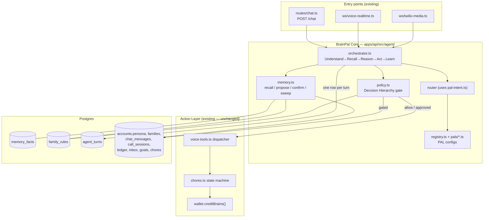
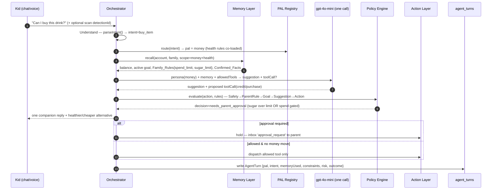

# BrainPal Agent Foundation — Technical Design

> Implements [`requirements.md`](./requirements.md). All file paths are relative to the repo root unless otherwise stated.

## Overview

This design adds an agent substrate **around** BrainPal's existing Action Layer rather than replacing any of it. Today a single conversational PAL is assembled inline in `apps/api/src/routes/chat.ts`: it calls `loadPalContext()` (the de-facto memory recall), builds a system prompt with `contextToSystemPrompt()`, parses an actionable intent with `parseIntent()` (whose own system prompt already calls itself "MoneyPal"), and — on `POST /chat/execute` — runs validated effects (`add_chore`, `topup`, `set_goal`). Voice paths (`ws/voice-realtime.ts`, `ws/twilio-media.ts`) reach the same effects through the `voice-tools.ts` dispatcher, which enforces the money-safety boundary (voice may create `pending` chores, never credit a wallet).

The foundation generalises this single inline flow into five named components from the product brief — **BrainPal Core (Orchestrator), Memory Layer, Policy Engine, PAL Registry, Audit Log** — while preserving the existing Action Layer (`voice-tools.ts`, `chores.ts` state machine, `wallet.creditBrains()`) untouched.

The central design decision: **a PAL is a configuration object, not a service or a separate model.** Each PAL (`core`, `money`, `health`, `study`, `safety`) is defined by `{ persona, allowedTools, memoryScope, policyProfile }`. The Orchestrator runs **one model call per turn**, assembled from the selected PAL's persona + recalled memory + exposed tools, then runs the deterministic Policy Engine before any tool dispatch, then writes one `agent_turns` audit row. This delivers "one conversation, many specialists, one shared memory" without distributed-agent complexity, and keeps the migration incremental: `chat.ts` becomes a thin caller of the Orchestrator instead of containing the logic.

Net-new server code lives in one new directory, `apps/api/src/agent/`, plus one shared type module, two new tables, and a parent-control route. Existing files are extended, not rewritten:

- **New:** `packages/shared/src/agent.ts` (the `AgentTurn` contract), `apps/api/src/agent/{orchestrator,memory,policy,registry}.ts`, `apps/api/src/agent/pals/{core,money,health,study,safety}.ts`, `apps/api/src/routes/agent-control.ts`, migration `0008_agent_foundation.sql`, Drizzle tables `memory_facts` + `family_rules` + `agent_turns`.
- **Extended:** `routes/chat.ts` (delegates to Orchestrator), `ws/voice-realtime.ts` + `ws/twilio-media.ts` (route tool calls through the Orchestrator/Policy Engine), `services/pal-context.ts` (becomes a Memory Layer recall source).
- **Unchanged:** `chores.ts`, `wallet.ts` (`creditBrains`), the `voice-tools.ts` effect functions, and the money-safety boundary.

## Architecture

### Component view



### Turn sequence — "Can I buy this drink?" (Money + Health combine)



## Components and Interfaces

### 1. The AgentTurn contract — `packages/shared/src/agent.ts`

Single source of truth (Requirement 1.2), imported by API and any client. Kept intentionally small:

```ts
export type PalName = 'core' | 'money' | 'health' | 'study' | 'safety'
export type RiskLevel = 'low' | 'medium' | 'high'
export type TurnOutcome = 'executed' | 'denied' | 'pending_parent'

export type AgentTurn = {
  id: string
  accountId: string
  familyId: string | null
  intent: string                 // 'buy_item' | 'add_chore' | 'query' | ...
  pal: PalName
  memoryUsed: string[]           // memory_facts ids recalled (audit/explainability)
  constraints: string[]          // applied rule ids from the Policy Engine
  risk: RiskLevel
  suggestion: string             // companion-voice reply (truncated in audit)
  confidence: number             // 0..1
  needsParentApproval: boolean
  toolCalls: { name: string; args: unknown }[]
  outcome: TurnOutcome
}
```

### 2. Memory Layer — `apps/api/src/agent/memory.ts`

Maps the five conceptual layers onto storage; only Family + Personal/Behavioral get new tables (Requirement 3, 4, 5).

| Layer | Backing store | New? | Lifetime |
|---|---|---|---|
| Session | `chat_messages`, `call_sessions.transcript` | reuse | expires (session window) |
| Personal | `accounts.persona` + `memory_facts (layer='personal')` | extend | until changed |
| Family | `family_rules` | **new** | until changed |
| Behavioral | `memory_facts (layer='behavioral')` | **new** | proposed→confirmed; expiry per TTL |
| System (global) | — | **out of scope** | — |

`memory_facts` (Drizzle in `db/schema.ts`):

```
id uuid pk
family_id uuid -> families
account_id uuid -> accounts (null for family-wide)
layer text         -- 'personal' | 'behavioral'
key text           -- e.g. 'favorite_snack', 'after_school_snack_pattern'
value jsonb
source text        -- 'health_pal' | 'money_pal' | 'parent' | ...
confidence numeric
status text         -- 'proposed' | 'confirmed' | 'expired'   (default 'proposed')
confirmed_by uuid -> accounts (null until confirmed)
confirmed_at timestamptz
expires_at timestamptz
created_at timestamptz
index (family_id), index (account_id, status), index (status, expires_at)
```

`family_rules`:

```
id uuid pk
family_id uuid -> families
kind text  -- 'sugar_limit_g' | 'weekly_allowance' | 'spend_limit_per_txn'
           -- | 'approved_merchants' | 'safe_zones' | 'health_threshold'
value jsonb
created_by uuid -> accounts
updated_at timestamptz
index (family_id, kind)
```

Service API (pure functions, testable in isolation):

```ts
recall(opts: { accountId; familyId; scope: PalName }): Promise<RecalledMemory>
  // returns { personal, behavioral (confirmed only), familyRules, sessionSummary }
  // honors PAL memoryScope; excludes status='expired' and (for action use) 'proposed'
propose(fact: { familyId; accountId?; layer; key; value; source; confidence; ttlSeconds? }): Promise<MemoryFact>
  // writes status='proposed', sends inbox kind='memory_suggestion' to confirmer
confirm(factId, confirmerId): Promise<void>      // promotes to 'confirmed'; conflict → see below
reject(factId, confirmerId): Promise<void>
sweep(): Promise<{ expired: number }>            // marks expirable facts 'expired'; never hard-deletes confirmed
consolidate(accountId): Promise<{ proposed: number }>
  // distills active behavioral facts + recent activity into proposed Summary_Facts
  // (source='consolidation', value.sourceFactIds=[...]); never expires raw facts itself
```

`recall()` composes existing `loadPalContext()` (balance, goals, chores, 7-day ledger) with `memory_facts` + `family_rules`. **Conflict rule (Req 4.6):** a new observation that contradicts a Confirmed_Fact is written as a *new* `proposed` fact; the old confirmed fact is untouched until the parent confirms the replacement. **Write discipline (Req 4):** agents may only call `propose()`. Nothing in agent code calls `confirm()` — only the Parent Control surface or a permitted kid self-confirm does.

**Memory consolidation (Requirement 13) — keeping memory bounded over years.** As a child uses BrainPal for months, granular Behavioral_Memory accumulates ("looked at gum", "bought juice Tuesday", …). Left unchecked this is noise, not memory. `consolidate(accountId)` is the long-horizon counterpart to `sweep()`: on a schedule, or when an account's active behavioral-fact count crosses a threshold, it reads those granular facts + recent `ledger` activity, asks the model to distill them into a few higher-level **Summary_Facts** ("Maya is a consistent saver; prefers fruit drinks over soda; motivated by goals, not streaks"), and writes each as a **proposed** fact via the same `propose()` path — `source='consolidation'`, with `value.sourceFactIds = [...]` recording the granular facts it covers. This needs **no schema change**: it reuses `status` and `value`.

The supersede flow:

```
consolidate()  → Summary_Fact { status:'proposed', source:'consolidation',
                                value:{ summary, sourceFactIds:[g1,g2,...] } }
parent confirms (Parent Control) → Summary_Fact.status='confirmed'
                                 → sweep() marks g1,g2,... status='expired' (soft, retained)
recall()       → returns the confirmed Summary_Fact; excludes the superseded 'expired' rows
```

Guarantees that keep this safe and non-lossy: a granular fact is only ever marked `expired` *after* a covering Summary_Fact is confirmed (Req 13.5); expiry is soft (`status` only) — confirmed facts are never hard-deleted (consistent with Req 5.5); `recall()` prefers the summary over its sources so a pattern is never double-counted (Req 13.7); and consolidation touches only behavioral/session-derived patterns — never confirmed profile facts, `family_rules`, `goals`, or the `ledger` (Req 13.6). If a parent rejects a summary, the granular facts stay active unchanged (Req 13.9). The result: a decade of usage compresses to a small, stable, parent-confirmed profile instead of an ever-growing pile — the same way human memory keeps "I like X" and forgets every individual meal.

### 3. Policy Engine — `apps/api/src/agent/policy.ts`

A deterministic function that runs **after** the model proposes and **before** any tool dispatch (Requirement 6.2). The model can never bypass it.

```ts
type PolicyInput = {
  pal: PalName
  intent: string
  candidate: { toolName?: string; args?: unknown; suggestion: string }
  rules: FamilyRule[]
  profile: PolicyProfile        // from the PAL config
}
type PolicyDecision = {
  effect: 'allow' | 'deny' | 'needs_parent_approval'
  appliedRuleIds: string[]      // → AgentTurn.constraints
  risk: RiskLevel
  reason: string
}
evaluate(input: PolicyInput): PolicyDecision
```

Evaluation order is fixed (Requirement 6.1): **Safety → Parent rules → Family goals → Best suggestion → Optional action.** A `deny` at a higher tier short-circuits lower tiers (6.3, 6.4). Safety reuses the existing `containsBannedPhrase()` and `getVerdict()` from `llm.ts` (Requirement 6.7) — no parallel safety logic. Any action whose risk exceeds the PAL's `policyProfile` threshold returns `needs_parent_approval` (6.8); the Orchestrator then holds the tool and raises an `inbox` `approval_request`.

**Money boundary (Requirement 7):** the Policy Engine denies any direct wallet credit proposed by an agent. Brain rewards may only flow through the existing `chores` `parent_approved → paid` transition. The existing parent-authenticated `POST /chat/execute` `topup` path remains the parent's own action (the parent is the authenticated actor); the Orchestrator must never originate a `topup`/credit from a kid turn or a caller-ID-only voice turn (7.3).

### 4. PAL Registry — `apps/api/src/agent/registry.ts` + `pals/*.ts`

```ts
export type PolicyProfile = {
  approvalRisk: RiskLevel        // actions at/above this risk need parent approval
  canMoveMoney: false            // always false for agents; money via chore transition only
}
export type PalConfig = {
  name: PalName
  status: 'enabled' | 'contract_only'
  persona: string                // system-prompt fragment (reuses contextToSystemPrompt style)
  allowedTools: string[]         // subset of voice-tools/intent operations
  memoryScope: ('personal' | 'behavioral' | 'family')[]
  policyProfile: PolicyProfile
}
```

| PAL | status | allowedTools | memoryScope | approvalRisk |
|---|---|---|---|---|
| `core` | enabled | (none — routes/answers only) | personal, family | medium |
| `money` | enabled | `find_child`, `create_task`, `set_goal`, allowance/spend guidance | personal, behavioral, family | low (any money move → approval) |
| `health` | enabled | read scans (`detectItems`), nutrition suggest (read-only) | personal, behavioral, family | medium |
| `study` | contract_only | (declared, none active) | personal, family | medium |
| `safety` | contract_only | (declared, none active) | family | low (highest gating) |

MoneyPal maps directly onto the existing `parseIntent` intents + `voice-tools`. HealthPal maps onto `bedrock.detectItems` + `llm.getVerdict` (read-only, never money — Req 9.2). `study`/`safety` exist as contracts only (Requirement 10); routing to them yields a graceful "not available yet" reply with no tool dispatch (Req 2.5, 10.3).

### 5. Orchestrator — `apps/api/src/agent/orchestrator.ts`

Implements the **Understand → Recall → Reason → Act → Learn** loop as one function:

```ts
runTurn(opts: {
  accountId: string
  channel: 'chat' | 'voice'
  message: string
  detectionId?: string          // optional scan context for HealthPal
}): Promise<{ reply: string; turn: AgentTurn; requiresConfirmation: boolean }>
```

Steps:
1. **Understand** — `parseIntent(message, ctx)` (existing) → `intent`.
2. **Route** — `registry.route(intent)` → one `PalConfig`. Unmappable → `core` (Req 2.4). `contract_only` → graceful reply, skip to Learn (Req 2.5).
3. **Recall** — `memory.recall({ accountId, familyId, scope: pal.memoryScope })`; record fact ids in `memoryUsed`.
4. **Reason** — one `llm.chat.completions.create` call with `persona + memory + history`, exposing **only** `pal.allowedTools` (Req 2.7).
5. **Act** — run `policy.evaluate(...)`. On `allow` and a non-money tool → dispatch via `voice-tools`. On `needs_parent_approval` → hold + `inbox` `approval_request`. On `deny` → still produce a best alternative suggestion (Req 6.5).
6. **Learn** — optionally `memory.propose(...)` for any observed pattern; persist one `agent_turns` row with the final `outcome` (Req 1.3). On failure after model output, persist `outcome='denied'`, dispatch nothing (Req 1.6).

`POST /chat` becomes: `const { reply, requiresConfirmation } = await runTurn({ accountId, channel:'chat', message })`. The existing `POST /chat/execute` stays as the confirmation endpoint that performs the gated effect once a parent confirms.

### 6. Parent Control surface — `apps/api/src/routes/agent-control.ts`

Restricted to `primary_parent` / `co_parent` via the existing `requireAuth` + membership checks (Req 11.6).

```
GET    /agent/memory?accountId=        list confirmed + proposed facts (family/child)
POST   /agent/memory/:id/confirm       promote proposed → confirmed
POST   /agent/memory/:id/reject        reject proposed
PATCH  /agent/memory/:id               edit a confirmed fact
DELETE /agent/memory/:id               reset/remove a fact (audited, Req 11.5)
GET    /agent/rules                     list family_rules
PUT    /agent/rules/:kind               set/replace a family_rule
GET    /agent/approvals                 pending needs_parent_approval turns
POST   /agent/approvals/:turnId/decide  approve|deny → releases/holds the Action Layer (Req 11.7)
```

A low-risk kid self-confirm for personal facts (Req 4.5) is exposed narrowly via `me.ts` (the kid's own profile), not this parent route.

## Data Model Summary

New tables in `db/schema.ts` + migration `supabase/migrations/0008_agent_foundation.sql`: `memory_facts`, `family_rules`, `agent_turns`. New `inbox.kind` values: `memory_suggestion`, `approval_request`. No changes to `ledger`, `chores`, `accounts`, `goals`. RLS mirrors the existing family-scope pattern (`memberships`), as established in migrations `0002`/`0003`.

## Error Handling

- Model/tool failure mid-turn → `agent_turns.outcome='denied'`, no dispatch (Req 1.6).
- `recall()` partial failure → degrade to `loadPalContext()` only; turn still completes with reduced memory.
- Policy `deny`/`needs_parent_approval` is a normal outcome, not an error: always paired with a companion-voice alternative (Req 6.5).
- Voice channel preserves the documented barge-in and caller-ID rules in `ws/twilio-media.ts`; the Orchestrator adds the policy gate without changing transport.

## Testing Strategy

- **Policy Engine** — pure-function table tests for the hierarchy: safety-deny overrides money-allow; parent-rule overrides money-allow; money move always `needs_parent_approval`; voice caller-ID turn cannot originate a credit (Req 6, 7).
- **Memory write discipline** — `propose()` never sets `confirmed`; conflicting observation creates a new proposed fact and leaves the confirmed one intact; expired facts excluded from recall (Req 4, 5).
- **Routing** — intent→PAL mapping; unmappable→`core`; `contract_only`→graceful no-tool reply (Req 2, 10).
- **Orchestrator integration** — "Can I buy this drink?" produces one `agent_turns` row, combines money+health rules, and gates correctly (Req 9.4).
- **Money boundary regression** — assert no agent code path reaches `ledger`/`creditBrains` except via chore transition (Req 7.1).
- Run `pnpm --filter @brainpal/api typecheck` before any push; shared types via `pnpm --filter @brainpal/shared build`.
