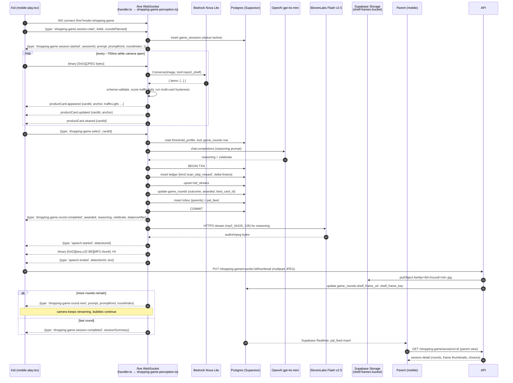
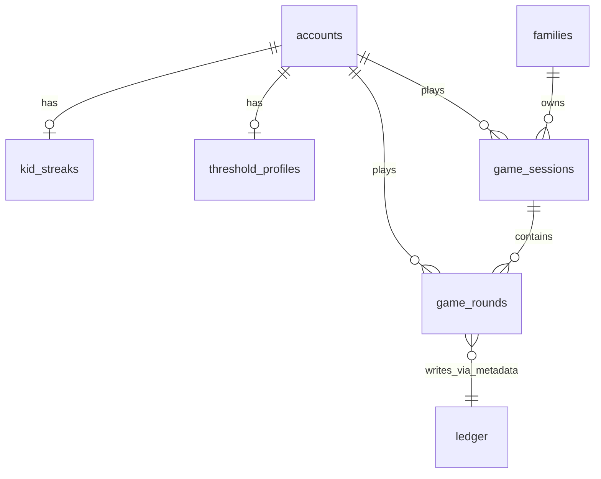

# Healthy Shopping Game — Technical Design

> Implements [`requirements.md`](./requirements.md). All file paths are relative to the repo root unless otherwise stated.

## Overview

The Healthy Shopping Game (HSG) layers a guided, multi-product live-camera loop on top of BrainPay's existing single-product perception pipeline. A parent configures a per-kid `Threshold_Profile` (sugar / protein / calories / carbs limits + allowed categories). The kid then opens a single live camera screen that streams JPEG frames continuously over the existing `/live` WebSocket; the API runs Bedrock Nova Lite vision in `Converse` tool-use mode on each frame, scores every detection against the active profile to compute a `Traffic_Light`, and emits per-card `productCard.appeared / updated / cleared` events with hysteresis (1 hit to appear, 5 misses to clear) so bubbles fade in over the live preview, follow products as the kid pans, and fade out when products leave the frame. When the kid taps a bubble, the server picks `best_card_id` from the cards visible at selection time, OpenAI generates a 1-sentence reasoning string voiced by ElevenLabs Flash v2.5 in the kid's chosen voice persona via the existing `speech.started → audio chunks → speech.ended` flow, a `ledger` row of kind `scan_skip_reward` is written with streak-multiplied Brains, an `inbox` event lands for parents, and a PAL feed entry is appended. The camera stays live across rounds — multiple rounds happen inside one camera session, not as separate screens.

The design reuses every existing primitive: family-first schema (Requirement 15 — RLS via `memberships`), `ledger` + `cached_balance` trigger (Requirement 8), Bedrock service (Requirement 3), the existing `/live` WebSocket transport including binary frame tag `0x01` and audio chunk tag `0x02`, ElevenLabs streaming TTS via `apps/api/src/ws/voice.ts` (Requirement 5.5, Requirement 14.3), OpenAI for reasoning (Requirement 5.4 + 9.3), and the `inbox` table for parent notifications (Requirement 1.9, Requirement 11.3). The only net-new server infrastructure is four tables (`threshold_profiles`, `game_sessions`, `game_rounds`, `kid_streaks`), one Supabase Storage bucket (`shelf-frames`), one new WebSocket per-connection state-machine module `apps/api/src/ws/shopping-game-perception.ts` (a sibling to `apps/api/src/ws/perception.ts` that copies its hysteresis pattern but tracks multiple simultaneous productCards), small additions to the existing WS dispatcher in `apps/api/src/ws/handler.ts`, a small HTTP route module `apps/api/src/routes/shopping-game.ts` (parent-only profile + history endpoints plus a thumbnail upload after selection), and three mobile screens: `kid/shopping-game/play.tsx`, `parent/shopping-game-settings/[kidId].tsx`, and `parent/shopping-game-history/[kidId].tsx`. The existing `apps/mobile/app/(app)/camera.tsx` and `apps/api/src/ws/perception.ts` are NOT modified.

## Architecture




## Data Models

### 3.1 New tables (Drizzle, append to `apps/api/src/db/schema.ts`)

```typescript
// ─── threshold_profiles ───────────────────────────────────────────────
// One row per kid (account_id is unique). Holds the parent-defined
// nutritional thresholds and the category allow-list (Requirement 1).
export const thresholdProfiles = pgTable(
  'threshold_profiles',
  {
    id: uuid('id').primaryKey().defaultRandom(),
    familyId: uuid('family_id')
      .references(() => families.id, { onDelete: 'cascade' })
      .notNull(),
    accountId: uuid('account_id')
      .references(() => accounts.id, { onDelete: 'cascade' })
      .notNull(),
    setByAccountId: uuid('set_by_account_id')
      .references(() => accounts.id, { onDelete: 'restrict' })
      .notNull(),
    sugarG: integer('sugar_g').notNull(),         // 0..50 (Req 1.3)
    proteinG: integer('protein_g').notNull(),     // 0..50
    caloriesKcal: integer('calories_kcal').notNull(), // 0..800
    carbsG: integer('carbs_g').notNull(),         // 0..100
    // Subset of: drink, snack, candy, fruit, vegetable, dairy, bakery,
    //            protein_bar, cereal, other (Req 1.5).
    allowedCategories: jsonb('allowed_categories')
      .notNull()
      .$type<string[]>()
      .default(sql`'[]'::jsonb`),
    roundsPerSession: integer('rounds_per_session').notNull().default(3), // Req 2.2 (1..5)
    revoked: integer('revoked').notNull().default(0), // 0|1 — Req 15.4 pause toggle
    voiceCommandsEnabled: integer('voice_commands_enabled').notNull().default(0), // Req 1.6
    logToJournal: integer('log_to_journal').notNull().default(0), // Req 12.3
    createdAt: timestamp('created_at', { withTimezone: true }).defaultNow().notNull(),
    updatedAt: timestamp('updated_at', { withTimezone: true }).defaultNow().notNull(),
  },
  (t) => ({
    uniqueAccount: uniqueIndex('threshold_profiles_account_unique').on(t.accountId),
    byFamily: index('threshold_profiles_family_idx').on(t.familyId),
  }),
)

// ─── game_sessions ────────────────────────────────────────────────────
// One row per Game_Session (Req 2). status: active | completed | abandoned.
export const gameSessions = pgTable(
  'game_sessions',
  {
    id: uuid('id').primaryKey().defaultRandom(),
    familyId: uuid('family_id')
      .references(() => families.id, { onDelete: 'cascade' })
      .notNull(),
    accountId: uuid('account_id')
      .references(() => accounts.id, { onDelete: 'cascade' })
      .notNull(),
    status: text('status').notNull().default('active'), // active|completed|abandoned
    roundsPlanned: integer('rounds_planned').notNull(),
    roundsCompleted: integer('rounds_completed').notNull().default(0),
    streakBefore: integer('streak_before').notNull(),
    streakAfter: integer('streak_after').notNull(),
    brainsAwarded: integer('brains_awarded').notNull().default(0),
    startedAt: timestamp('started_at', { withTimezone: true }).defaultNow().notNull(),
    lastActiveAt: timestamp('last_active_at', { withTimezone: true }).defaultNow().notNull(),
    completedAt: timestamp('completed_at', { withTimezone: true }),
  },
  (t) => ({
    byFamily: index('game_sessions_family_started_idx').on(t.familyId, t.startedAt),
    byAccount: index('game_sessions_account_started_idx').on(t.accountId, t.startedAt),
  }),
)

// ─── game_rounds ──────────────────────────────────────────────────────
// One row per Round. Holds the frozen ProductCard list and the outcome.
export const gameRounds = pgTable(
  'game_rounds',
  {
    id: uuid('id').primaryKey().defaultRandom(),
    sessionId: uuid('session_id')
      .references(() => gameSessions.id, { onDelete: 'cascade' })
      .notNull(),
    familyId: uuid('family_id')
      .references(() => families.id, { onDelete: 'cascade' })
      .notNull(),
    accountId: uuid('account_id')
      .references(() => accounts.id, { onDelete: 'cascade' })
      .notNull(),
    roundIndex: integer('round_index').notNull(), // 1..roundsPlanned
    promptKind: text('prompt_kind').notNull(),    // 'best_choice'|'best_of_bad'|'pop_quiz_sugar'|'pop_quiz_protein'|'pop_quiz_calories'
    // Frame metadata is set ONLY after a successful selection followed by
    // PUT /shopping-game/rounds/:id/thumbnail (Req 11.4, 15.1). In-flight
    // frames stream over WebSocket and are never persisted.
    shelfFrameUrl: text('shelf_frame_url'),       // signed URL or storage path; null until thumbnail upload
    shelfFrameKey: text('shelf_frame_key'),       // bucket object key (for delete on TTL); null until thumbnail upload
    shelfScanId: uuid('shelf_scan_id').notNull().defaultRandom(),
    productCards: jsonb('product_cards')
      .notNull()
      .$type<ProductCardRow[]>()
      .default(sql`'[]'::jsonb`),
    bestCardId: text('best_card_id'),     // null until cards are scored
    selectedCardId: text('selected_card_id'),
    selectedAt: timestamp('selected_at', { withTimezone: true }),
    hintUsed: integer('hint_used').notNull().default(0), // Req 9.4
    outcome: text('outcome'),            // 'correct'|'incorrect'|'errored'|null
    awarded: integer('awarded').notNull().default(0),
    multiplier: numeric('multiplier', { precision: 4, scale: 2 }).default('1.00'),
    streakBefore: integer('streak_before'),
    streakAfter: integer('streak_after'),
    reasoning: text('reasoning'),
    correctionMetadata: jsonb('correction_metadata')
      .notNull()
      .default(sql`'{}'::jsonb`), // Req 10
    createdAt: timestamp('created_at', { withTimezone: true }).defaultNow().notNull(),
    completedAt: timestamp('completed_at', { withTimezone: true }),
  },
  (t) => ({
    bySession: index('game_rounds_session_idx').on(t.sessionId, t.roundIndex),
    byFamilyCreated: index('game_rounds_family_created_idx').on(t.familyId, t.createdAt),
  }),
)

// ─── kid_streaks ──────────────────────────────────────────────────────
// One row per kid. Separate table (not accounts.persona) because it is
// updated transactionally with ledger writes — keeping it isolated avoids
// jsonb merge contention. See open question 16.2.
export const kidStreaks = pgTable(
  'kid_streaks',
  {
    accountId: uuid('account_id')
      .primaryKey()
      .references(() => accounts.id, { onDelete: 'cascade' }),
    streak: integer('streak').notNull().default(0),
    longestStreak: integer('longest_streak').notNull().default(0),
    lastRoundAt: timestamp('last_round_at', { withTimezone: true }),
    updatedAt: timestamp('updated_at', { withTimezone: true }).defaultNow().notNull(),
  },
)
```

### 3.2 Shared types

Place in `packages/shared/src/shopping-game.ts` (re-export from package root):

```typescript
export type TrafficLight = 'green' | 'yellow' | 'red'
export type ProductCategory =
  | 'drink' | 'snack' | 'candy' | 'fruit' | 'vegetable'
  | 'dairy' | 'bakery' | 'protein_bar' | 'cereal' | 'other'

export interface ProductCard {
  id: string                        // stable per-round card id (uuid)
  name: string                      // e.g. "Coca-Cola Classic 375ml"
  category: ProductCategory
  sugar_g: number                   // ≥ 0
  protein_g: number                 // ≥ 0
  calories_kcal: number             // ≥ 0
  carbs_g: number                   // ≥ 0
  bbox: [number, number, number, number] // x,y,w,h ∈ [0,1]
  confidence: number                // 0..1
  trafficLight: TrafficLight
  score: number                     // count of fields ≤ threshold (Req 4.5)
}

// Internal row shape persisted in game_rounds.product_cards jsonb.
export interface ProductCardRow extends ProductCard {
  isBest: boolean
}

export interface ShelfScanResponse {
  shelf_scan_id: string
  round_id: string
  prompt: string                    // human-readable prompt for the kid
  prompt_kind: 'best_choice' | 'best_of_bad' | 'pop_quiz_sugar' | 'pop_quiz_protein' | 'pop_quiz_calories'
  items: ProductCard[]              // best_card_id is NOT exposed to the client
}

export type RoundOutcome = 'correct' | 'incorrect' | 'errored'

export interface SelectRoundResponse {
  awarded: number
  balance_after: number
  streak_before: number
  streak_after: number
  multiplier: number
  outcome: RoundOutcome
  best_card_id: string
  reasoning: string
  celebrate: boolean
}
```

### 3.3 Reuse

| Existing table | New usage |
|---|---|
| `ledger` | `kind = 'scan_skip_reward'` already in CHECK constraint. Metadata adds `{ game_session_id, round_id, selected_card_id, best_card_id, outcome, streak_before, streak_after, multiplier, hint_used, prompt_kind }` (Req 8.6). |
| `inbox` | `kind = 'hsg_threshold_missing'` (Req 1.9) and `kind = 'hsg_session_complete'` (Req 11.3). |
| `accounts.cached_balance` | Updated automatically by the existing `ledger_bump_balance` trigger on insert. No new trigger needed. |
| `accounts.persona.voiceId` | Drives ElevenLabs voice id mapping in §8. |

### 3.4 Migration

`supabase/migrations/0004_shopping_game.sql`:

```sql
-- BrainPal P0 — Healthy Shopping Game schema (HSG).
-- Source of truth: .kiro/specs/healthy-shopping-game/design.md § 3.

-- ─── threshold_profiles ──────────────────────────────────────────────
create table if not exists public.threshold_profiles (
  id                      uuid primary key default gen_random_uuid(),
  family_id               uuid not null references public.families(id) on delete cascade,
  account_id              uuid not null references public.accounts(id) on delete cascade,
  set_by_account_id       uuid not null references public.accounts(id) on delete restrict,
  sugar_g                 int not null check (sugar_g between 0 and 50),
  protein_g               int not null check (protein_g between 0 and 50),
  calories_kcal           int not null check (calories_kcal between 0 and 800),
  carbs_g                 int not null check (carbs_g between 0 and 100),
  allowed_categories      jsonb not null default '[]'::jsonb,
  rounds_per_session      int not null default 3 check (rounds_per_session between 1 and 5),
  revoked                 int not null default 0 check (revoked in (0,1)),
  voice_commands_enabled  int not null default 0,
  log_to_journal          int not null default 0,
  created_at              timestamptz not null default now(),
  updated_at              timestamptz not null default now(),
  unique (account_id)
);
create index if not exists threshold_profiles_family_idx on public.threshold_profiles (family_id);

-- ─── game_sessions ───────────────────────────────────────────────────
create table if not exists public.game_sessions (
  id                uuid primary key default gen_random_uuid(),
  family_id         uuid not null references public.families(id) on delete cascade,
  account_id        uuid not null references public.accounts(id) on delete cascade,
  status            text not null default 'active' check (status in ('active','completed','abandoned')),
  rounds_planned    int not null check (rounds_planned between 1 and 5),
  rounds_completed  int not null default 0,
  streak_before     int not null,
  streak_after      int not null,
  brains_awarded    int not null default 0,
  started_at        timestamptz not null default now(),
  last_active_at    timestamptz not null default now(),
  completed_at      timestamptz
);
create index if not exists game_sessions_family_started_idx  on public.game_sessions (family_id, started_at desc);
create index if not exists game_sessions_account_started_idx on public.game_sessions (account_id, started_at desc);

-- ─── game_rounds ─────────────────────────────────────────────────────
create table if not exists public.game_rounds (
  id                  uuid primary key default gen_random_uuid(),
  session_id          uuid not null references public.game_sessions(id) on delete cascade,
  family_id           uuid not null references public.families(id) on delete cascade,
  account_id          uuid not null references public.accounts(id) on delete cascade,
  round_index         int not null,
  prompt_kind         text not null check (prompt_kind in
    ('best_choice','best_of_bad','pop_quiz_sugar','pop_quiz_protein','pop_quiz_calories')),
  -- shelf_frame_url and shelf_frame_key are populated AFTER the kid selects a
  -- card via PUT /shopping-game/rounds/:id/thumbnail. In-flight frames are
  -- never persisted (Req 15.1).
  shelf_frame_url     text,
  shelf_frame_key     text,
  shelf_scan_id       uuid not null default gen_random_uuid(),
  product_cards       jsonb not null default '[]'::jsonb,
  best_card_id        text,
  selected_card_id    text,
  selected_at         timestamptz,
  hint_used           int not null default 0,
  outcome             text check (outcome in ('correct','incorrect','errored')),
  awarded             int not null default 0,
  multiplier          numeric(4,2) default 1.00,
  streak_before       int,
  streak_after        int,
  reasoning           text,
  correction_metadata jsonb not null default '{}'::jsonb,
  created_at          timestamptz not null default now(),
  completed_at        timestamptz
);
create index if not exists game_rounds_session_idx        on public.game_rounds (session_id, round_index);
create index if not exists game_rounds_family_created_idx on public.game_rounds (family_id, created_at desc);

-- ─── kid_streaks ─────────────────────────────────────────────────────
create table if not exists public.kid_streaks (
  account_id      uuid primary key references public.accounts(id) on delete cascade,
  streak          int not null default 0,
  longest_streak  int not null default 0,
  last_round_at   timestamptz,
  updated_at      timestamptz not null default now()
);

-- ─── ledger CHECK extension ──────────────────────────────────────────
-- 'scan_skip_reward' already permitted in 0002; nothing to do.

-- ─── RLS ─────────────────────────────────────────────────────────────
alter table public.threshold_profiles enable row level security;
alter table public.game_sessions      enable row level security;
alter table public.game_rounds        enable row level security;
alter table public.kid_streaks        enable row level security;

create policy threshold_profiles_family_scope on public.threshold_profiles
  for all
  using  (family_id in (select family_id from public.memberships where account_id = auth.uid()))
  with check (family_id in (select family_id from public.memberships where account_id = auth.uid()));

create policy game_sessions_family_scope on public.game_sessions
  for all
  using  (family_id in (select family_id from public.memberships where account_id = auth.uid()))
  with check (family_id in (select family_id from public.memberships where account_id = auth.uid()));

create policy game_rounds_family_scope on public.game_rounds
  for all
  using  (family_id in (select family_id from public.memberships where account_id = auth.uid()))
  with check (family_id in (select family_id from public.memberships where account_id = auth.uid()));

create policy kid_streaks_self_or_family on public.kid_streaks
  for select using (
    account_id = auth.uid()
    or account_id in (
      select m.account_id from public.memberships m
      where m.family_id in (select family_id from public.memberships where account_id = auth.uid())
    )
  );

-- ─── shelf-frames bucket (idempotent storage policy bootstrap) ───────
-- Bucket itself is created via the Supabase dashboard or admin API in
-- the rollout step (§ 11). RLS policies live on storage.objects.
create policy if not exists "shelf_frames_family_read" on storage.objects
  for select using (
    bucket_id = 'shelf-frames'
    and (storage.foldername(name))[1] = 'family'
    and (storage.foldername(name))[2] in (
      select family_id::text from public.memberships where account_id = auth.uid()
    )
  );
```

### 3.5 ER overview




## Components and Interfaces

This section defines every server, service, mobile, and integration component. Sub-sections mirror the structure requested in the original brief: API surface, vision pipeline, reward / streak math, reasoning, voice, mobile screens, state management, privacy, performance, and rollout.

### 4. API surface

The HSG runtime is split between a small HTTP route module (parent setup + history + post-selection thumbnail upload + speak proxy) and the WebSocket-driven game loop (§ 5 below). Routes live in `apps/api/src/routes/shopping-game.ts` and are mounted in `apps/api/src/routes/index.ts`:

```typescript
// apps/api/src/routes/index.ts
import { shoppingGame } from './shopping-game'
routes.route('/', shoppingGame)
```

All HTTP endpoints require `requireAuth` middleware. The handler reads `accountId` via `authedAccountId(c)`. Family-scope is enforced by joining the kid's `memberships.family_id` and asserting the caller shares it.

| Method | Path | Auth role | Purpose |
|---|---|---|---|
| `POST` | `/shopping-game/threshold-profiles` | parent in same family | Create or update profile (Req 1) |
| `GET`  | `/shopping-game/threshold-profiles/:kidId` | parent or kid (self) | Read profile |
| `GET`  | `/shopping-game/sessions/:id` | parent or kid (self) | Read full session detail (Req 11.4) |
| `GET`  | `/shopping-game/sessions?kidId=…` | parent | List recent sessions for a kid (Req 11) |
| `PUT`  | `/shopping-game/rounds/:id/thumbnail` | kid (self) | Upload one JPEG ≤ 1 MB after a Round completes; sets `shelf_frame_url` / `shelf_frame_key` |
| `POST` | `/shopping-game/speak` | any authed | Reasoning → MP3 stream with `voiceId` override (used by parent history replays) |

Game-loop traffic — session start, productCard streaming, card selection, hint, correction, round transitions, session completion — runs over the existing `/live` WebSocket. See § 5.

**Removed from earlier design (replaced by WS events in § 5):**

- `POST /shopping-game/sessions` → WS `shopping-game.session.start`
- `POST /shopping-game/sessions/:id/rounds` (multipart frame upload) → continuous binary `0x01` JPEG frames over `/live`
- `POST /shopping-game/rounds/:id/select` → WS `shopping-game.select`
- `POST /shopping-game/rounds/:id/hint` → WS `shopping-game.hint`
- `POST /shopping-game/rounds/:id/correct-card` → WS `shopping-game.card.correct`

### 4.1 Detailed request / response shapes

**`POST /shopping-game/threshold-profiles`** — parent only

```jsonc
// request
{
  "kidId": "uuid",
  "sugar_g": 12,
  "protein_g": 5,
  "calories_kcal": 200,
  "carbs_g": 30,
  "allowed_categories": ["fruit","snack","dairy","protein_bar"],
  "rounds_per_session": 3,
  "voice_commands_enabled": false,
  "log_to_journal": true,
  "revoked": false
}
// response 200
{
  "profile": { /* full row, see § 3.2 */ },
  "updated_at": "2025-01-..."
}
// errors
// 400 invalid_range — value outside Req 1.3 bounds (clamp on client; server also clamps)
// 403 not_parent_in_family
// 404 kid_not_in_family
```

**`GET /shopping-game/threshold-profiles/:kidId`**
```jsonc
// 200
{ "profile": { /* row */ } | null }
```

**`GET /shopping-game/sessions/:id`** — Req 11.4
```jsonc
// 200
{
  "session": { /* game_sessions row */ },
  "rounds": [
    {
      "id": "uuid",
      "round_index": 1,
      "prompt_kind": "best_choice",
      // signed URL; null until the post-selection thumbnail upload lands.
      "shelf_frame_url": "https://...signed..." | null,
      "items": [/* ProductCardRow[] captured at moment of selection */],
      "selected_card_id": "card_02",
      "best_card_id": "card_01",
      "outcome": "incorrect",
      "awarded": 1,
      "reasoning": "..."
    }
  ]
}
```

**`GET /shopping-game/sessions?kidId=…&limit=20`** — parent only
```jsonc
// 200
{ "sessions": [/* game_sessions rows, reverse-chronological */] }
```

**`PUT /shopping-game/rounds/:id/thumbnail`** — kid self only
```http
PUT /shopping-game/rounds/<rid>/thumbnail
Content-Type: multipart/form-data; boundary=...
Content-Length: ≤ 1048576

frame=<jpeg bytes>
```
```jsonc
// 200
{ "shelf_frame_url": "https://...signed...", "shelf_frame_key": "family/<fid>/round/<rid>.jpg" }
// 409 already_uploaded — round already has a non-null shelf_frame_key
// 410 round_not_finalized — round outcome is still null; thumbnails only after select completes
// 413 file_too_large — > 1 MB
```
This is a one-shot per round. The server validates that `game_rounds.outcome` is non-null before accepting the upload (so the kid cannot exfiltrate arbitrary frames mid-game). Implementation chosen over a WS binary tag because it's simpler, idempotent on retry, and avoids interleaving with the live frame stream.

**`POST /shopping-game/speak`** — re-uses ElevenLabs path of `/voice/onboard/speak`, but accepts `voiceId` so the kid's chosen persona drives the audio. Used by the parent-side history view to replay cached reasoning audio. Live in-game audio plays over the WS `speech.started` / audio chunk / `speech.ended` flow already in `apps/api/src/ws/voice.ts`, so kids never call this endpoint.
```jsonc
// request
{ "text": "Greek yogurt has 14g protein...", "voiceId": "sarcastic" }
// 200
// audio/mpeg stream (mp3_44100_128)
```

### 4.2 Validation

All HTTP bodies are validated with `zod` schemas colocated in `apps/api/src/routes/shopping-game.schemas.ts`. WS event bodies are validated with sibling zod schemas in `apps/api/src/ws/shopping-game-events.ts` (see § 5.2). The `ProductCard` schema in §5 is shared between the vision pipeline, the WS event layer, and the route layer.


### 5. Vision pipeline (WebSocket-driven, multi-card hysteresis)

The HSG vision pipeline reuses the existing `/live` WebSocket transport at `apps/api/src/ws/handler.ts`. Frames arrive as binary `[0x01][JPEG bytes]` messages identical to the existing camera flow. A new sibling state-machine module `apps/api/src/ws/shopping-game-perception.ts` runs alongside (NOT replacing) `apps/api/src/ws/perception.ts`. It copies the per-connection state pattern, copies the hysteresis approach, and reuses the same `crypto.randomUUID()` → `detectionId` (here renamed `cardId`) — but tracks **multiple simultaneous productCards** instead of one, and emits namespaced `productCard.*` and `shopping-game.*` events instead of `detection.*`.

### 5.1 WebSocket connection upgrade

Connections to `/live?mode=shopping-game` enter a "shopping-game" branch in `handler.ts`:

```typescript
// apps/api/src/ws/handler.ts (additions)
import { onShoppingGameMessage, dropShoppingGameSession, newShoppingGameSession }
  from './shopping-game-perception'

export function onConnect(ws: WebSocket, req: IncomingMessage) {
  const url = new URL(req.url ?? '/', 'http://x')
  const mode = url.searchParams.get('mode')
  if (mode === 'shopping-game') {
    newShoppingGameSession(ws)
    ws.send(JSON.stringify({ type: 'shopping-game.ready' }))
    return
  }
  // existing camera flow — unchanged
  const state = newSession(ws)
  ws.send(JSON.stringify({ type: 'session.started', sessionId: state.sessionId }))
}

export function onMessage(ws: WebSocket, data: Buffer) {
  if (data.length > 0 && data[0] === 0x01) {
    const jpeg = decodeFrame(new Uint8Array(data))
    if (!jpeg) return
    const sgState = getShoppingGameSession(ws)
    if (sgState) {
      onShoppingGameFrame(ws, jpeg).catch((err) =>
        logger.error({ err: String(err) }, 'sg.frame.handler_failed'))
      return
    }
    onFrame(ws, jpeg).catch((err) => logger.error({ err: String(err) }, 'frame.handler_failed'))
    return
  }
  // JSON path: dispatch to shopping-game handler when in that mode.
  try {
    const msg = JSON.parse(data.toString()) as { type?: string }
    if (typeof msg.type === 'string' && msg.type.startsWith('shopping-game.')) {
      onShoppingGameMessage(ws, msg).catch((err) =>
        logger.error({ err: String(err) }, 'sg.message.handler_failed'))
      return
    }
    // existing dispatch — unchanged
    switch (msg.type) {
      case 'interrupt': interrupt(ws); break
      case 'session.end': ws.close(); break
    }
  } catch { /* non-JSON */ }
}

export function onClose(ws: WebSocket) {
  dropShoppingGameSession(ws)
  dropSession(ws)
}
```

The existing single-product camera flow at `apps/mobile/app/(app)/camera.tsx` remains untouched — it never sends `mode=shopping-game`, so it always lands in the existing branch.

### 5.2 WebSocket event protocol

All events are JSON-encoded text messages on the same socket that carries the binary `0x01` frame uplink and the binary `0x02` audio downlink. Event `type` strings are namespaced `shopping-game.*` to avoid colliding with the existing `detection.*` events.

**Client → server**

| `type` | Payload | When |
|---|---|---|
| `shopping-game.session.start` | `{ kidId: string, roundsPlanned: number }` | First message after `shopping-game.ready` |
| `shopping-game.select` | `{ cardId: string }` | Kid taps a bubble |
| `shopping-game.hint` | `{}` | Kid taps "Ask PAL" |
| `shopping-game.card.correct` | `{ cardId: string, action: 'remove'|'rename', newName?: string }` | Long-press correction modal (Req 10) |
| `shopping-game.session.abandon` | `{}` | Kid taps Skip / Done; also auto-sent on background > 10 min |

Plus the existing binary uplink: `[0x01][JPEG bytes]` at ~700ms intervals while the camera is open.

**Server → client**

| `type` | Payload | When |
|---|---|---|
| `shopping-game.ready` | `{}` | After WS upgrade in `mode=shopping-game` |
| `shopping-game.session.started` | `{ sessionId, prompt, promptKind, roundIndex, roundsPlanned, streakBefore }` | After `session.start` |
| `productCard.appeared` | `{ cardId, name, brand?, category, anchor: [x,y], bbox, trafficLight, confidence, score, lowConfidence }` | Hysteresis: 1 hit |
| `productCard.updated` | `{ cardId, anchor: [x,y], bbox }` | Same card, anchor moved |
| `productCard.cleared` | `{ cardId }` | Hysteresis: 5 misses |
| `shopping-game.hint` | `{ hint: string }` or `{ error: 'hint_unavailable' }` | After `shopping-game.hint` |
| `shopping-game.card.corrected` | `{ removedCardIds?: string[], renamedCardId?: string, items: ProductCard[] }` | After `shopping-game.card.correct` |
| `shopping-game.round.completed` | `{ roundId, outcome, awarded, multiplier, balanceAfter, streakBefore, streakAfter, bestCardId, reasoning, celebrate }` | After `shopping-game.select` |
| `speech.started` | `{ detectionId }` | Reasoning audio begins (existing voice.ts flow) |
| binary `[0x02][seq u32 BE][MP3]` | — | Reasoning audio chunks (existing flow) |
| `speech.ended` | `{ detectionId, text }` | Reasoning audio complete |
| `shopping-game.round.next` | `{ prompt, promptKind, roundIndex }` | Server-initiated next round; camera keeps streaming |
| `shopping-game.session.completed` | `{ sessionSummary: { totalAwarded, streakAfter, rounds: [...] } }` | All planned rounds done |
| `shopping-game.error` | `{ code: 'hsg_threshold_missing' | 'hsg_revoked' | 'session_closed' | 'invalid_card_id' | 'already_selected' | 'feature_disabled', message: string }` | Any unrecoverable error |

### 5.3 Per-connection state machine — `shopping-game-perception.ts`

This module COPIES the pattern from `apps/api/src/ws/perception.ts` (per-connection `WeakMap<WebSocket, SgState>`, hysteresis on hit/miss counts, `crypto.randomUUID()` for ids) but does NOT modify it. Sibling module, sibling tests.

```typescript
// apps/api/src/ws/shopping-game-perception.ts
import type { WebSocket } from 'ws'
import { logger } from '../logger'
import { callBedrockShelfScan } from '../services/shelf-scan'
import { resolvePersona } from '../services/voice-persona'
import { finalizeRound } from '../services/round-finalize'
import { generateHint } from '../services/shopping-game-llm'
import { speakReaction } from './voice'

const HITS_TO_APPEAR = 1
const MISSES_TO_CLEAR = 5
const SAME_CARD_MOVE_EPSILON = 0.005 // anchor change below this is suppressed

type CardTrack = {
  cardId: string                  // crypto.randomUUID
  itemKey: string                 // slugified name; identity across frames
  hits: number
  misses: number
  appeared: boolean               // true after HITS_TO_APPEAR fires
  lastAnchor: [number, number]
  card: ProductCard               // last full payload sent to client
}

export type SgSessionState = {
  sessionId: string | null        // server-side game_sessions.id; null until session.started
  kidId: string | null
  familyId: string | null
  roundsPlanned: number
  roundIndex: number              // 1..roundsPlanned
  promptKind: PromptKind
  streakBefore: number
  // Card tracking — keyed by stable itemKey so identity survives across frames.
  tracks: Map<string, CardTrack>
  // Last frame JPEG bytes — kept in memory only until either the next frame
  // overwrites it OR a select fires (in which case mobile uploads its own
  // fresh frame via PUT /thumbnail). Never persisted.
  inFlight: boolean               // true while a Bedrock call is outstanding
  selecting: boolean              // true between select and round.completed
}

const sessions = new WeakMap<WebSocket, SgSessionState>()

export function newShoppingGameSession(ws: WebSocket): SgSessionState { /* … */ }
export function getShoppingGameSession(ws: WebSocket) { return sessions.get(ws) }
export function dropShoppingGameSession(ws: WebSocket) { sessions.delete(ws) }
```

### 5.4 Frame handler (multi-card hysteresis)

For each `[0x01][JPEG]` arriving in `mode=shopping-game`:

```typescript
export async function onShoppingGameFrame(ws: WebSocket, jpegBytes: Uint8Array): Promise<void> {
  const state = sessions.get(ws); if (!state || state.selecting || !state.sessionId) return
  if (state.inFlight) return                  // drop frame if Bedrock still busy
  state.inFlight = true
  try {
    const profile = await loadProfile(state.kidId!)
    const allowed = new Set(profile.allowed_categories)
    const raw = await callBedrockShelfScan(jpegBytes)
    const cards = raw
      .map((r) => scoreCard(r, profile, allowed))   // attach trafficLight, score
      .filter((c) => c.confidence >= 0.4)

    // 1. Match each detection to a tracked card by stable itemKey.
    const seenKeys = new Set<string>()
    for (const c of cards) {
      const key = slugify(c.name)
      seenKeys.add(key)
      const existing = state.tracks.get(key)
      const anchor: [number, number] = [c.bbox[0] + c.bbox[2] / 2, c.bbox[1] + c.bbox[3] / 2]
      if (existing) {
        existing.hits += 1; existing.misses = 0; existing.card = c
        if (!existing.appeared && existing.hits >= HITS_TO_APPEAR) {
          existing.appeared = true
          ws.send(JSON.stringify({ type: 'productCard.appeared', ...projectAppeared(existing.cardId, c, anchor) }))
        } else if (existing.appeared && distance(existing.lastAnchor, anchor) > SAME_CARD_MOVE_EPSILON) {
          ws.send(JSON.stringify({ type: 'productCard.updated', cardId: existing.cardId, anchor, bbox: c.bbox }))
        }
        existing.lastAnchor = anchor
      } else {
        const cardId = crypto.randomUUID()
        const track: CardTrack = { cardId, itemKey: key, hits: 1, misses: 0, appeared: false, lastAnchor: anchor, card: c }
        state.tracks.set(key, track)
        if (HITS_TO_APPEAR === 1) {
          track.appeared = true
          ws.send(JSON.stringify({ type: 'productCard.appeared', ...projectAppeared(cardId, c, anchor) }))
        }
      }
    }

    // 2. Bump misses on every tracked card NOT seen this frame; clear at threshold.
    for (const [key, track] of state.tracks) {
      if (seenKeys.has(key)) continue
      track.misses += 1; track.hits = 0
      if (track.misses >= MISSES_TO_CLEAR) {
        if (track.appeared) ws.send(JSON.stringify({ type: 'productCard.cleared', cardId: track.cardId }))
        state.tracks.delete(key)
      }
    }
  } catch (err) {
    logger.error({ err: String(err), sessionId: state.sessionId }, 'sg.frame.failed')
  } finally {
    state.inFlight = false
  }
}
```

Constants:

- `HITS_TO_APPEAR = 1` — same as `perception.ts`. Bubbles fade in on first detection.
- `MISSES_TO_CLEAR = 5` — same as `perception.ts`. Bubbles fade out after ~3.5 s of absence at 700 ms cadence.
- `SAME_CARD_MOVE_EPSILON = 0.005` — suppress jittery `productCard.updated` events when the kid is holding still.
- `confidence ≥ 0.4` filter — same threshold as `perception.ts`. Cards below 0.6 still fire (Req 10.1) but appear with `lowConfidence: true`.

### 5.5 Session start / select / round transitions

```typescript
export async function onShoppingGameMessage(ws: WebSocket, msg: AnyMsg): Promise<void> {
  const state = sessions.get(ws); if (!state) return
  switch (msg.type) {
    case 'shopping-game.session.start': return startSession(ws, state, msg)
    case 'shopping-game.select':         return handleSelect(ws, state, msg.cardId)
    case 'shopping-game.hint':           return handleHint(ws, state)
    case 'shopping-game.card.correct':   return handleCorrect(ws, state, msg)
    case 'shopping-game.session.abandon':return abandonSession(ws, state)
  }
}

async function startSession(ws, state, { kidId, roundsPlanned }) {
  // Validate threshold profile + revoked guard. Reject with shopping-game.error
  // codes hsg_threshold_missing or hsg_revoked.
  const profile = await loadProfile(kidId)
  if (!profile)        return wsError(ws, 'hsg_threshold_missing')
  if (profile.revoked) return wsError(ws, 'hsg_revoked')
  // Insert game_sessions row. Snapshot streak_before. Initialize state.
  const session = await insertSession({ kidId, roundsPlanned, streakBefore: profile.streak ?? 0 })
  state.sessionId = session.id
  state.kidId = kidId
  state.familyId = session.familyId
  state.roundsPlanned = roundsPlanned
  state.roundIndex = 1
  state.streakBefore = profile.streak ?? 0
  // Insert a placeholder game_rounds row (round_index=1) so we have an id to
  // attribute productCard events to.
  const round = await insertRound({ sessionId: session.id, roundIndex: 1, promptKind: 'best_choice' })
  state.promptKind = round.promptKind
  ws.send(JSON.stringify({
    type: 'shopping-game.session.started',
    sessionId: session.id,
    prompt: promptCopy(round.promptKind),
    promptKind: round.promptKind,
    roundIndex: 1,
    roundsPlanned,
    streakBefore: state.streakBefore,
  }))
}

async function handleSelect(ws, state, cardId) {
  if (state.selecting) return wsError(ws, 'already_selected')
  state.selecting = true

  // 1. Snapshot the current ProductCard set into game_rounds.product_cards
  //    (the cards visible at the moment of selection; this is what the parent
  //    sees in history).
  const snapshot = [...state.tracks.values()].filter(t => t.appeared).map(t => ({ ...t.card, id: t.cardId }))
  const selected = snapshot.find((c) => c.id === cardId)
  if (!selected) { state.selecting = false; return wsError(ws, 'invalid_card_id') }

  // 2. Decide promptKind and best_card_id for THIS round, against THIS snapshot.
  //    (best_of_bad / pop-quiz / best_choice rules from § 5.6 below.)
  const { promptKind, bestCardId } = decidePromptAndBest(snapshot, state)
  await persistRoundSnapshot(state.sessionId!, state.roundIndex, snapshot, bestCardId, promptKind)

  // 3. Finalize: ledger + streak + reasoning + parent inbox.
  const { reasoning, celebrate, awarded, multiplier, streakAfter, balanceAfter, outcome } =
    await finalizeRound(currentRoundId(state), cardId, { /* ctx */ })

  // 4. Tell the kid the result.
  ws.send(JSON.stringify({
    type: 'shopping-game.round.completed',
    roundId: currentRoundId(state),
    outcome, awarded, multiplier, balanceAfter,
    streakBefore: state.streakBefore, streakAfter,
    bestCardId, reasoning, celebrate,
  }))

  // 5. Voice playback via existing speakReaction flow in apps/api/src/ws/voice.ts.
  //    speech.started → audio chunks → speech.ended.
  const persona = resolvePersona(/* kid voiceId */)
  speakReaction(ws, currentRoundId(state), { line: reasoning, voiceId: persona.elevenVoiceId },
                new AbortController()).catch((err) => logger.error({ err: String(err) }, 'sg.voice.failed'))

  // 6. Either advance to next round or close out the session.
  if (state.roundIndex >= state.roundsPlanned) {
    await markSessionCompleted(state.sessionId!)
    ws.send(JSON.stringify({ type: 'shopping-game.session.completed', sessionSummary: await loadSummary(state.sessionId!) }))
    state.selecting = false
    return
  }
  state.roundIndex += 1
  state.streakBefore = streakAfter
  // Fresh round_id; clear card tracks so the next round starts with a clean overlay
  // (camera keeps streaming, bubbles re-detect from the next frame onward).
  state.tracks.clear()
  const nextRound = await insertRound({ sessionId: state.sessionId!, roundIndex: state.roundIndex, promptKind: 'best_choice' })
  state.promptKind = nextRound.promptKind
  ws.send(JSON.stringify({
    type: 'shopping-game.round.next',
    prompt: promptCopy(nextRound.promptKind),
    promptKind: nextRound.promptKind,
    roundIndex: state.roundIndex,
  }))
  state.selecting = false
}
```

### 5.6 Bedrock prompt (`report_shelf` tool spec)

Unchanged from earlier design. The prompt and tool schema described below live in `apps/api/src/services/shelf-scan.ts` and are called from `shopping-game-perception.ts` (above) on every frame:

```typescript
const SHELF_PROMPT = `You are looking at a single shelf in a supermarket photographed by a 10-14 year-old kid playing a nutrition game.

Detect every distinct PACKAGED PRODUCT or PIECE OF PRODUCE that is reasonably visible in the frame. Up to 12 items. Skip price tags, shelf labels, hands, and background scenery.

For each detected product, estimate:
  - name: the most specific brand+product you can read or recognise.
  - category: ONE of drink, snack, candy, fruit, vegetable, dairy, bakery, protein_bar, cereal, other.
  - sugar_g, protein_g, calories_kcal, carbs_g per serving (non-negative).
  - bbox: [x, y, w, h] normalised 0..1 from the top-left corner.
  - confidence: 0..1.

Use the report_shelf tool to return your findings. Do not invent products that are not visible.`

const SHELF_TOOL_INPUT_SCHEMA = {
  type: 'object',
  properties: {
    items: {
      type: 'array', maxItems: 12,
      items: {
        type: 'object',
        properties: {
          name: { type: 'string' },
          category: { type: 'string', enum: ['drink','snack','candy','fruit','vegetable','dairy','bakery','protein_bar','cereal','other'] },
          sugar_g: { type: 'number', minimum: 0 },
          protein_g: { type: 'number', minimum: 0 },
          calories_kcal: { type: 'number', minimum: 0 },
          carbs_g: { type: 'number', minimum: 0 },
          bbox: { type: 'array', items: { type: 'number', minimum: 0, maximum: 1 }, minItems: 4, maxItems: 4 },
          confidence: { type: 'number', minimum: 0, maximum: 1 },
        },
        required: ['name','category','sugar_g','protein_g','calories_kcal','carbs_g','bbox','confidence'],
      },
    },
  },
  required: ['items'],
} as const
```

### 5.7 Bedrock call

```typescript
export async function callBedrockShelfScan(jpegBytes: Uint8Array): Promise<ProductCardRaw[]> {
  const cmd = new ConverseCommand({
    modelId: env.BEDROCK_MODEL_ID, // amazon.nova-lite-v1:0 default
    messages: [{
      role: 'user',
      content: [
        { image: { format: 'jpeg', source: { bytes: jpegBytes } } },
        { text: SHELF_PROMPT },
      ],
    }],
    toolConfig: {
      tools: [{ toolSpec: { name: 'report_shelf', description: 'Reports every product detected on the shelf.', inputSchema: { json: SHELF_TOOL_INPUT_SCHEMA as any } } }],
      toolChoice: { tool: { name: 'report_shelf' } },
    },
    inferenceConfig: { temperature: 0, maxTokens: 1500 },
  })
  const resp = await client.send(cmd)
  const block = resp.output?.message?.content?.find((b) => 'toolUse' in b)?.toolUse
  return ProductCardListRaw.parse(block?.input ?? { items: [] }).items
}
```

### 5.8 Server-side scoring

```typescript
function computeTrafficLight(c: ProductCardRaw, p: ThresholdProfile, allowed: Set<string>): TrafficLight {
  const overByPercent = (val: number, max: number) => max <= 0 ? 0 : (val - max) / max
  const sugarOver    = overByPercent(c.sugar_g,       p.sugar_g)
  const calOver      = overByPercent(c.calories_kcal, p.calories_kcal)
  const carbsOver    = overByPercent(c.carbs_g,       p.carbs_g)
  const proteinShort = p.protein_g <= 0 ? 0 : (p.protein_g - c.protein_g) / p.protein_g
  const overs = [sugarOver, calOver, carbsOver, proteinShort]
  const maxOver = Math.max(...overs)

  if (maxOver <= 0 && allowed.has(c.category)) return 'green'
  if (maxOver <= 0.25) return 'yellow'
  return 'red'
}

function scoreCard(c: ProductCardRaw, p: ThresholdProfile): number {
  let s = 0
  if (c.sugar_g       <= p.sugar_g)       s++
  if (c.protein_g     >= p.protein_g)     s++
  if (c.calories_kcal <= p.calories_kcal) s++
  if (c.carbs_g       <= p.carbs_g)       s++
  return s
}

function pickBest(cards: ProductCard[], promptKind: PromptKind): string {
  if (promptKind === 'best_of_bad') {
    return [...cards].sort((a, b) =>
      a.sugar_g - b.sugar_g || a.calories_kcal - b.calories_kcal
    )[0].id
  }
  if (promptKind === 'pop_quiz_sugar')    return [...cards].sort((a, b) => b.sugar_g - a.sugar_g)[0].id
  if (promptKind === 'pop_quiz_protein')  return [...cards].sort((a, b) => b.protein_g - a.protein_g)[0].id
  if (promptKind === 'pop_quiz_calories') return [...cards].sort((a, b) => a.calories_kcal - b.calories_kcal)[0].id
  return [...cards].sort((a, b) => b.score - a.score || a.sugar_g - b.sugar_g)[0].id
}
```

`promptKind` decision (run at the moment of selection against the snapshot, NOT per frame):
- `everyRed = snapshot.every(c => c.trafficLight === 'red')` → `best_of_bad`.
- Else, if `roundsPlanned > 1` and the session has not yet had a pop quiz and `Math.random() < 1/roundsPlanned`, choose one pop quiz.
- Else `best_choice`.

### 5.9 Schema validation (zod)

```typescript
import { z } from 'zod'

export const ProductCardRaw = z.object({
  name: z.string().min(1).max(120),
  category: z.enum([
    'drink','snack','candy','fruit','vegetable',
    'dairy','bakery','protein_bar','cereal','other',
  ]),
  sugar_g:       z.number().nonnegative().max(200),
  protein_g:     z.number().nonnegative().max(200),
  calories_kcal: z.number().nonnegative().max(2000),
  carbs_g:       z.number().nonnegative().max(500),
  bbox:          z.tuple([z.number().min(0).max(1), z.number().min(0).max(1),
                          z.number().min(0).max(1), z.number().min(0).max(1)]),
  confidence:    z.number().min(0).max(1),
})
export const ProductCardListRaw = z.object({ items: z.array(ProductCardRaw).max(12) })
```

### 5.10 Frame ownership and privacy

Frames stream over WebSocket in transient memory only — they are never written to disk on the server. After Bedrock returns, the JPEG bytes are released. The only persisted artifact is a single thumbnail per round, captured by the mobile client at the moment of selection and uploaded via `PUT /shopping-game/rounds/:id/thumbnail` (§ 4). Mobile holds the latest frame in memory between frames; immediately after `shopping-game.round.completed`, it grabs the freshest frame, re-encodes at lower quality, and PUTs it. Server validates that `game_rounds.outcome` is non-null before accepting (§ 4.1) so the kid cannot upload arbitrary frames mid-game. See § 11 for retention.


### 6. Reward + streak math

Implemented in `apps/api/src/services/round-finalize.ts` and called from the `shopping-game.select` WS event handler in `apps/api/src/ws/shopping-game-perception.ts`. The pure service signature, transaction shape, ledger metadata, streak transitions, and constants are identical to the earlier HTTP-route version — only the trigger differs (WS event handler instead of `POST /shopping-game/rounds/:id/select`). The `round-finalize.ts` module itself is unchanged from earlier design and stays unit-testable in isolation.

### 6.1 Constants

```typescript
const BASE_CORRECT   = 5      // Req 8.1
const BASE_INCORRECT = 1      // Req 8.2 (participation)
const HINT_FACTOR    = 0.5    // Req 9.4
const BEST_OF_BAD_FACTOR = 0.5 // Req 7.4

function streakMultiplier(streak: number): number {
  if (streak >= 10) return 2.0   // Req 8.4
  if (streak >= 5)  return 1.5
  if (streak >= 3)  return 1.25
  return 1.0
}
```

### 6.2 Pseudocode (single-transaction finalize)

```typescript
async function finalizeRound(roundId: string, selectedCardId: string): Promise<SelectRoundResponse> {
  return db.transaction(async (tx) => {
    // 1. Load round + session under FOR UPDATE to serialize selects.
    const round = await tx
      .select().from(gameRounds).where(eq(gameRounds.id, roundId))
      .for('update').then(rows => rows[0])
    if (!round) throw new HttpError(404, 'round_not_found')
    if (round.outcome) throw new HttpError(409, 'already_selected')

    // 2. Validate selection exists in the persisted card list.
    const cards = round.productCards as ProductCardRow[]
    const selected = cards.find(c => c.id === selectedCardId)
    if (!selected) throw new HttpError(400, 'invalid_card_id')

    // 3. Re-read profile and streak (must exist — Req 1.8).
    const profile = await tx.select().from(thresholdProfiles)
      .where(eq(thresholdProfiles.accountId, round.accountId)).then(r => r[0])
    if (!profile) throw new HttpError(412, 'hsg_threshold_missing')

    const streakRow = await tx.select().from(kidStreaks)
      .where(eq(kidStreaks.accountId, round.accountId)).for('update').then(r => r[0])
    const streakBefore = streakRow?.streak ?? 0

    // 4. Compute outcome.
    const isCorrect = selectedCardId === round.bestCardId
    const isBestOfBad = round.promptKind === 'best_of_bad'
    const outcome: RoundOutcome = isCorrect ? 'correct' : 'incorrect'

    // 5. Compute base reward (Req 8.1, 8.2; Req 7.4 halves on best_of_bad correct).
    let base = isCorrect ? BASE_CORRECT : BASE_INCORRECT
    if (isCorrect && isBestOfBad) base = base * BEST_OF_BAD_FACTOR
    if (round.hintUsed === 1 && isCorrect && !isBestOfBad) base = base * HINT_FACTOR

    // 6. Compute streak_after (Req 8.3, Req 7.5).
    let streakAfter = streakBefore
    if (isBestOfBad)        streakAfter = streakBefore   // never advance
    else if (isCorrect)     streakAfter = streakBefore + 1
    else                    streakAfter = 0

    // 7. Multiplier from streak_after (so kid sees the bump on the round it earned it).
    const multiplier = streakMultiplier(streakAfter)

    // 8. Final reward (Req 8.5, 8.8 — never negative, never zero).
    const awarded = Math.max(1, Math.floor(base * multiplier))

    // 9. Reasoning (§ 7) — done outside the txn-critical path before write,
    //    or with timeout fallback to template.
    const { reasoning, celebrate } = await generateReasoning(round, selected, profile)

    // 10. Insert ledger row (existing trigger updates accounts.cached_balance).
    const [ledgerRow] = await tx.insert(ledger).values({
      familyId: round.familyId,
      accountId: round.accountId,
      actorId: round.accountId,
      kind: 'scan_skip_reward',
      brainsDelta: awarded,
      balanceAfter: 0, // computed in returning via subquery (see 6.3)
      metadata: {
        game_session_id: round.sessionId,
        round_id: round.id,
        selected_card_id: selectedCardId,
        best_card_id: round.bestCardId,
        outcome,
        streak_before: streakBefore,
        streak_after: streakAfter,
        multiplier,
        hint_used: round.hintUsed === 1,
        prompt_kind: round.promptKind,
      },
    }).returning()

    // 11. Upsert kid_streaks.
    await tx.insert(kidStreaks).values({
      accountId: round.accountId,
      streak: streakAfter,
      longestStreak: Math.max(streakRow?.longestStreak ?? 0, streakAfter),
      lastRoundAt: new Date(),
      updatedAt: new Date(),
    }).onConflictDoUpdate({
      target: kidStreaks.accountId,
      set: { streak: streakAfter, longestStreak: sql`greatest(${kidStreaks.longestStreak}, ${streakAfter})`,
             lastRoundAt: new Date(), updatedAt: new Date() },
    })

    // 12. Update round + session counters.
    await tx.update(gameRounds).set({
      selectedCardId, selectedAt: new Date(), outcome,
      awarded, multiplier: String(multiplier),
      streakBefore, streakAfter, reasoning,
      completedAt: new Date(),
    }).where(eq(gameRounds.id, round.id))

    await tx.update(gameSessions).set({
      roundsCompleted: sql`${gameSessions.roundsCompleted} + 1`,
      brainsAwarded: sql`${gameSessions.brainsAwarded} + ${awarded}`,
      streakAfter,
      lastActiveAt: new Date(),
      // Mark complete if this was the last round.
      status: sql`case when ${gameSessions.roundsCompleted} + 1 >= ${gameSessions.roundsPlanned}
                       then 'completed' else 'active' end`,
      completedAt: sql`case when ${gameSessions.roundsCompleted} + 1 >= ${gameSessions.roundsPlanned}
                            then now() else null end`,
    }).where(eq(gameSessions.id, round.sessionId))

    // 13. Inbox + PAL feed (Req 11). PAL feed is the existing `inbox` table
    //     scoped to parents — see § 11. Both go through the same path.
    await writeParentInboxEvents(tx, round, outcome, awarded, streakAfter)

    // 14. Read balance_after from cached_balance (trigger has run).
    const [{ cachedBalance }] = await tx.select({ cachedBalance: accounts.cachedBalance })
      .from(accounts).where(eq(accounts.id, round.accountId))

    return {
      awarded,
      balance_after: cachedBalance,
      streak_before: streakBefore,
      streak_after: streakAfter,
      multiplier,
      outcome,
      best_card_id: round.bestCardId!,
      reasoning,
      celebrate,
    }
  })
}
```

### 6.3 Note on `balance_after` in ledger

The existing `bump_cached_balance` trigger updates `accounts.cached_balance` on every ledger insert, but the inserted ledger row's own `balance_after` column is set by the application before the trigger fires. To keep `ledger.balance_after` truthful we capture it inside the same transaction by reading `cached_balance` AFTER insert and updating the ledger row, OR we replace `balance_after` with a computed read (current implementation in `routes/me.ts` and `routes/family.ts` uses `cached_balance` for display anyway). The simplest correct path: write a CTE-style insert that locks the account row, computes the new balance, and inserts the ledger row with that value. Pseudocode:

```sql
with prev as (
  select cached_balance + $delta as balance_after
    from accounts where id = $accountId for update
)
insert into ledger (..., balance_after) select ..., balance_after from prev returning *;
```

Then the trigger applies the same delta and the values agree. Action item: confirm this in implementation; the existing code path was P0-only with no concurrent writes per kid.

### 6.4 PAL feed write helper

The PAL feed is implemented as `inbox` rows with `kind = 'pal_feed_hsg_round'` for each parent in the family (Req 11.1, 11.2). Realtime delivery uses Supabase's existing `realtime` channel on `inbox` filtered by `account_id`.

```typescript
async function writeParentInboxEvents(tx, round, outcome, awarded, streakAfter) {
  const parents = await tx.select({ accountId: memberships.accountId })
    .from(memberships)
    .where(and(
      eq(memberships.familyId, round.familyId),
      inArray(memberships.role, ['primary_parent', 'co_parent']),
    ))
  if (parents.length === 0) return

  const cards = round.productCards as ProductCardRow[]
  const selected = cards.find(c => c.id === round.selectedCardId)
  const best = cards.find(c => c.id === round.bestCardId)

  await tx.insert(inbox).values(parents.map(p => ({
    accountId: p.accountId,
    kind: 'pal_feed_hsg_round',
    title: `${kidName} ${outcome === 'correct' ? 'nailed it' : 'tried'} on round ${round.roundIndex}`,
    body: `Picked ${selected?.name}. Best was ${best?.name}. +${awarded} 🧠. Streak ${streakAfter}.`,
    metadata: {
      session_id: round.sessionId,
      round_id: round.id,
      kid_account_id: round.accountId,
      outcome, awarded, streak: streakAfter,
      selected_card_id: round.selectedCardId,
      best_card_id: round.bestCardId,
    },
  })))
}
```


### 7. Reasoning generation

Implemented in `apps/api/src/services/shopping-game-llm.ts`. Used by `/select` (Req 5.4) and `/hint` (Req 9.3).

### 7.1 Model

`gpt-4o-mini` for both reasoning and hint. TTFT ~150 ms, complete-response ~300–600 ms, well inside Req 5.4 (2 s) and Req 14.3 prerequisite. Reuses the existing `llm` client in `apps/api/src/services/llm.ts`.

### 7.2 Voice persona mapping

The kid's voice (set in `apps/mobile/app/(auth)/kid-persona.tsx`, stored in `accounts.persona.voiceId`) influences the LLM tone via a system-prompt prefix and selects the ElevenLabs voice id (§ 8). Mapping table in `apps/api/src/services/voice-persona.ts`:

```typescript
export const VOICE_PERSONAS = {
  sarcastic: { elevenVoiceId: env.ELEVENLABS_VOICE_ID_SARCASTIC, tone: 'dry, observational, slightly mean about products (never the kid)' },
  cool:      { elevenVoiceId: env.ELEVENLABS_VOICE_ID_COOL,      tone: 'casual, big-brother energy, hype the good picks' },
  wise:      { elevenVoiceId: env.ELEVENLABS_VOICE_ID_WISE,      tone: 'calm and patient, explain like a wise wizard' },
  hyped:     { elevenVoiceId: env.ELEVENLABS_VOICE_ID_HYPED,     tone: 'high-energy hype-coach, celebrate every correct pick' },
  chill:     { elevenVoiceId: env.ELEVENLABS_VOICE_ID_CHILL,     tone: 'laid-back surfer, low-stakes vibe' },
  auntie:    { elevenVoiceId: env.ELEVENLABS_VOICE_ID_AUNTIE,    tone: 'sassy auntie, gossipy and warm' },
} as const
```

Fallback: if `voiceId` is missing or unknown, use `sarcastic` and `env.ELEVENLABS_VOICE_ID`.

### 7.3 Reasoning prompt

```typescript
const REASONING_SYSTEM = `You are PAL, a nutrition coach for a kid aged 10-14. You speak in 1 to 2 sentences, max 30 words. Tone: {tone}.

The kid just made a choice in a shelf game. Compare the chosen item to the actually-best item (when they differ). When the chosen item IS the best, congratulate briefly and name the standout nutrient. When wrong, name the specific number gap (e.g. "3g sugar vs 22g") so the kid learns. Never call the kid stupid. No "you should". No emojis.

Return strict JSON: { "reasoning": string, "celebrate": boolean }.
"celebrate" is true ONLY when outcome is correct AND it's not a best_of_bad round.`

const reasoningUser = (chosen: ProductCard, best: ProductCard, profile: ThresholdProfile, promptKind: PromptKind) => `
Outcome: ${chosen.id === best.id ? 'correct' : 'incorrect'}
Prompt: ${promptKind}
Chosen: ${chosen.name} (cat=${chosen.category}, sugar=${chosen.sugar_g}g, protein=${chosen.protein_g}g, kcal=${chosen.calories_kcal}, carbs=${chosen.carbs_g}g, light=${chosen.trafficLight})
Best:   ${best.name}   (cat=${best.category}, sugar=${best.sugar_g}g, protein=${best.protein_g}g, kcal=${best.calories_kcal}, carbs=${best.carbs_g}g, light=${best.trafficLight})
Profile thresholds: sugar≤${profile.sugar_g}g, protein≥${profile.protein_g}g, kcal≤${profile.calories_kcal}, carbs≤${profile.carbs_g}g.
`
```

```typescript
export async function generateReasoning(
  round: GameRoundRow,
  selected: ProductCard,
  profile: ThresholdProfile,
  voicePersona: keyof typeof VOICE_PERSONAS,
): Promise<{ reasoning: string; celebrate: boolean }> {
  const cards = round.productCards as ProductCardRow[]
  const best = cards.find(c => c.id === round.bestCardId)!
  const tone = VOICE_PERSONAS[voicePersona].tone
  try {
    const resp = await llm.chat.completions.create({
      model: 'gpt-4o-mini',
      messages: [
        { role: 'system', content: REASONING_SYSTEM.replace('{tone}', tone) },
        { role: 'user',   content: reasoningUser(selected, best, profile, round.promptKind) },
      ],
      response_format: { type: 'json_object' },
      temperature: 0.6,
      max_tokens: 120,
    })
    const parsed = JSON.parse(resp.choices[0]?.message?.content ?? '{}')
    return {
      reasoning: typeof parsed.reasoning === 'string' && parsed.reasoning.length <= 240
        ? parsed.reasoning
        : templateReasoning(selected, best, round.promptKind),
      celebrate: !!parsed.celebrate && selected.id === best.id && round.promptKind !== 'best_of_bad',
    }
  } catch (err) {
    logger.warn({ err: String(err) }, 'shopping_game.reasoning_failed')
    return {
      reasoning: templateReasoning(selected, best, round.promptKind),
      celebrate: selected.id === best.id && round.promptKind !== 'best_of_bad',
    }
  }
}
```

### 7.4 Deterministic fallback (Req 5.8)

```typescript
function templateReasoning(c: ProductCard, b: ProductCard, kind: PromptKind): string {
  if (c.id === b.id) {
    if (kind === 'best_of_bad') return `Out of a junky shelf, ${c.name} is the least bad — lowest sugar at ${c.sugar_g}g.`
    if (kind === 'pop_quiz_sugar')    return `Yep, ${c.name} has the most sugar at ${c.sugar_g}g.`
    if (kind === 'pop_quiz_protein')  return `Right — ${c.name} has the most protein at ${c.protein_g}g.`
    if (kind === 'pop_quiz_calories') return `Right — ${c.name} has the fewest calories at ${c.calories_kcal} kcal.`
    return `${c.name} wins on protein (${c.protein_g}g) and stays under your sugar limit (${c.sugar_g}g).`
  }
  // Wrong: name the single biggest gap.
  const gaps: { field: string; diff: number; unit: string; aim: 'low'|'high' }[] = [
    { field: 'sugar',    diff: c.sugar_g       - b.sugar_g,       unit: 'g',    aim: 'low'  },
    { field: 'protein',  diff: b.protein_g     - c.protein_g,     unit: 'g',    aim: 'high' },
    { field: 'calories', diff: c.calories_kcal - b.calories_kcal, unit: 'kcal', aim: 'low'  },
    { field: 'carbs',    diff: c.carbs_g       - b.carbs_g,       unit: 'g',    aim: 'low'  },
  ].filter(g => g.diff > 0)
  const worst = gaps.sort((a, z) => z.diff - a.diff)[0]
  if (!worst) return `${b.name} was the better pick on balance.`
  return `${b.name} had ${worst.aim === 'low' ? 'less' : 'more'} ${worst.field} than ${c.name} — ${b[`${worst.field}_g` as never] ?? ''}${worst.unit} vs ${c[`${worst.field}_g` as never] ?? ''}${worst.unit}.`
}
```

### 7.5 Hint prompt (Req 9.3)

```typescript
const HINT_SYSTEM = `You are PAL coaching a kid through a shelf game. Tone: {tone}. The kid asked for a hint. NAME the two highest-scoring items by their "name" field as a friendly steer, but DO NOT say which is correct. Max 18 words. No emojis.`

const hintUser = (top2: ProductCard[]) =>
  `Top two: ${top2.map(c => c.name).join(' and ')}. Tease without revealing the answer.`
```


### 8. Voice integration

In-game reasoning audio plays through the **existing** ElevenLabs Flash v2.5 WS streaming flow at `apps/api/src/ws/voice.ts`. After `shopping-game.round.completed` is sent, `shopping-game-perception.ts` calls `speakReaction(ws, roundId, ctx, abort)` from `voice.ts` — the same function that already powers `apps/api/src/ws/perception.ts`. The flow is identical: server emits `speech.started` → streams binary `[0x02][seq u32 BE][MP3]` chunks via `encodeAudioChunk` → emits `speech.ended`. The mobile client decodes audio chunks via the existing `lib/ws.ts` `onAudioChunk` callback. No new audio transport is introduced.

The HTTP `POST /shopping-game/speak` endpoint (§ 4) is retained ONLY for the parent-side history view, which replays cached reasoning by re-synthesizing the stored text in the kid's persona voice. Kids never call this endpoint during gameplay.

### 8.1 New endpoint

`POST /shopping-game/speak` accepts `{ text, voiceId }` (kid persona id, not a raw ElevenLabs voice). The route resolves `voiceId → ELEVENLABS_VOICE_ID_*` via `VOICE_PERSONAS` and proxies to ElevenLabs with `model_id=eleven_flash_v2_5`, `output_format=mp3_44100_128`. Body is the audio MP3 bytes. We deliberately use the non-streaming HTTPS endpoint here (same as `voice-onboard.ts`) because:

- The parent history view replays a one-shot audio clip — no need for streaming.
- For a 30-word reasoning string Flash v2.5 typically returns full audio in <800 ms (Req 14.3 — irrelevant to parent replay but matches the kid-side WS flow), and `expo-audio` `createAudioPlayer({ uri })` plays from the MP3 file as soon as the buffer hits cache.

```typescript
shoppingGame.post('/shopping-game/speak', requireAuth, async (c) => {
  const { text, voiceId } = await c.req.json<{ text: string; voiceId?: string }>()
  if (!text || text.length > 500) return c.json({ error: 'invalid_input' }, 400)
  const persona = VOICE_PERSONAS[voiceId as keyof typeof VOICE_PERSONAS] ?? VOICE_PERSONAS.sarcastic
  const elevenVoiceId = persona.elevenVoiceId ?? env.ELEVENLABS_VOICE_ID
  const url = `https://api.elevenlabs.io/v1/text-to-speech/${elevenVoiceId}?output_format=mp3_44100_128`
  const res = await fetch(url, {
    method: 'POST',
    headers: { 'xi-api-key': env.ELEVENLABS_API_KEY, 'Content-Type': 'application/json', Accept: 'audio/mpeg' },
    body: JSON.stringify({
      text, model_id: 'eleven_flash_v2_5',
      voice_settings: { stability: 0.4, similarity_boost: 0.85, style: 0.6, use_speaker_boost: true },
    }),
  })
  if (!res.ok) return c.json({ error: 'tts_failed' }, 503)
  const buf = await res.arrayBuffer()
  return new Response(buf, { status: 200, headers: { 'Content-Type': 'audio/mpeg', 'Content-Length': String(buf.byteLength) } })
})
```

### 8.2 Mobile playback (in-game, WS path)

Inside `apps/mobile/app/(app)/kid/shopping-game/play.tsx`, audio chunks arrive via the existing `connectLive` callback:

```typescript
const sock = connectLive({
  onJson: (msg) => dispatch(msg),
  onAudioChunk: (seq, mp3) => audioBuffer.push(seq, mp3),
})
```

`audioBuffer` reassembles the MP3 in seq order, writes it to `${FileSystem.cacheDirectory}hsg-${roundId}.mp3` after `speech.ended`, and plays via `createAudioPlayer({ uri: path }).play()`. The reasoning text is rendered the moment `shopping-game.round.completed` arrives, so the kid sees the answer instantly and hears it ~500–800 ms later.

### 8.3 Mobile playback (parent history)

The parent history detail screen calls `POST /shopping-game/speak` with the stored `reasoning` and the kid's `voiceId`, writes the response bytes to cache, and plays. Same `createAudioPlayer` pattern.


### 9. Mobile screens

Routes under `apps/mobile/app/(app)/kid/shopping-game/` and `apps/mobile/app/(app)/parent/`. Existing components reused: `ChatBubble`, `tokens` theme, `lib/api.ts` fetch wrapper, `lib/ws.ts` `connectLive`. The new design has **three** screens (down from six earlier) — the entire kid-side gameplay collapses into a single live-camera screen that owns the session lifecycle.

| Path | Purpose | Reuses |
|---|---|---|
| `(app)/parent/shopping-game-settings/[kidId].tsx` | Threshold profile form: 4 sliders (sugar / protein / calories / carbs), 10-category multi-select, rounds-per-session stepper (1–5), voice-commands switch, log-to-journal switch, pause/resume toggle. POSTs to `/shopping-game/threshold-profiles`. | `tokens`, existing wizard layout |
| `(app)/parent/shopping-game-history/[kidId].tsx` | Reverse-chronological session list at the top, per-session detail rendered when a session is tapped (push or expandable depending on platform). Detail shows the post-selection frame thumbnail per round (signed URL via `expo-image`), every detected ProductCard name + Traffic_Light, kid's selection, best card, reasoning string, and a play-reasoning button that calls `POST /shopping-game/speak`. Req 11.4. | `lib/api.ts`, `expo-image`, `expo-audio` |
| `(app)/kid/shopping-game/play.tsx` | **Single screen** owning the entire camera-session lifecycle. Re-uses `expo-camera` and the existing 700ms frame loop pattern from `apps/mobile/app/(app)/camera.tsx`. Connects to `/live` WS with `?mode=shopping-game`, sends `shopping-game.session.start` with `roundsPlanned`, streams binary `0x01` frames continuously, renders multiple `ProductCardBubble` overlays, handles tap (select), long-press (correction modal), hint button, reasoning reveal, between-rounds prompt, session-summary sheet, and Skip / Done abandon. | `expo-camera`, `expo-image-manipulator`, `lib/ws.ts`, `expo-audio`, `FogWake` / `RippleRing` / `CoinBadge` patterns from `camera.tsx` |

A "Healthy Shopping Game" tile is added to `(app)/kid/index.tsx` (kid home) — disabled with the "your parent has paused this game" copy when `threshold_profiles.revoked = 1` (Req 15.4). Tapping it routes directly to `play.tsx?roundsPlanned=N`.

A matching settings card is added to `(app)/parent/kid-detail.tsx` linking to `shopping-game-settings/[kidId]` and `shopping-game-history/[kidId]`.

**Removed from earlier design (folded into `play.tsx`):**

- `(app)/kid/shopping-game/start.tsx` — start logic happens via `shopping-game.session.start` WS event the moment `play.tsx` mounts.
- `(app)/kid/shopping-game/round.tsx` — the entire round flow (camera + bubbles + tap + correction) is the steady state of `play.tsx`.
- `(app)/kid/shopping-game/round-summary.tsx` — folded into `play.tsx` as a slide-up reasoning-bubble overlay that does not stop the camera.
- `(app)/kid/shopping-game/session-summary.tsx` — folded into `play.tsx` as a bottom-sheet at session completion.

### 9.1 `play.tsx` state machine

`play.tsx` is a long-lived screen. The camera and WS stay live across rounds; UI state changes the overlay only.

```
                            ┌──────────────────┐
                            │ camera_starting  │  expo-camera + WS handshake
                            └────────┬─────────┘
                                     │ ws ready + session.started
                                     ▼
        ┌──────────────────────── live_streaming ────────────────────────┐
        │  bubbles fade in/out via productCard.* events                  │
        │  ───────────────────────────────────────────────────────────── │
        │  user taps bubble ─────▶ selecting (bubbles fade out,          │
        │                                     "PAL is reacting" pulse)   │
        │  user long-presses bubble ─▶ correction_modal                  │
        │  user taps "Ask PAL"   ────▶ hint banner (hint event + reply)  │
        └──────────────────────┬─────────────────────────┬───────────────┘
                               │                         │
                               ▼                         │
                       reasoning_reveal                  │
              (reasoning bubble slides up,               │
               audio plays via WS speech.*)              │
                               │                         │
                ┌──────────────┴──────────┐              │
                │                         │              │
                ▼                         ▼              │
       round.next received        session.completed      │
       (next-round prompt          (summary sheet        │
        slides in 1s, fades)        slides up)           │
                │                         │              │
                ▼                         ▼              │
        live_streaming           dismissed → kid home    │
                                   or replay (re-enters  │
                                    camera_starting)     │
```

**Camera never stops streaming.** During `selecting` and `reasoning_reveal`, frames keep arriving server-side but the server suppresses `productCard.*` event emission (state.selecting=true in § 5.5) so the overlay UI is stable. After `round.next`, frames resume populating bubbles for the next round.

### 9.2 ProductCardBubble component

```typescript
// apps/mobile/components/ProductCardBubble.tsx
type Props = {
  card: ProductCard           // includes anchor [x,y] in [0,1] viewport space
  trafficLight: 'green'|'yellow'|'red'
  lowConfidence: boolean
  onTap: () => void
  onLongPress: () => void
}
```

- Position absolutely over the camera view at `(anchor.x * width, anchor.y * height)`.
- Border color from `tokens.trafficLight[trafficLight]`.
- Border style `'dashed'` when `lowConfidence`.
- Animates `productCard.appeared` in via `Animated.spring` (scale 0.4 → 1) and fades out on `productCard.cleared`.
- `productCard.updated` smoothly tweens the position via `Animated.timing(150ms)` so the bubble follows the product as the kid pans.

### 9.3 Reasoning bubble overlay (in-screen replacement for round-summary)

Slides up from the bottom 60% of the screen on `shopping-game.round.completed`. Contains:

- Outcome banner (correct / incorrect, traffic-light colored)
- Brains delta with multiplier badge
- Reasoning text (rendered immediately)
- Pulsing "PAL is reacting" indicator while audio plays
- "Next round →" or "See summary ↑" button
- Camera view remains visible behind a 60% black scrim

When the reasoning bubble is showing AND `shopping-game.round.next` arrives, the bubble auto-fades after a short "Next: spot the most sugar" tag slides in from the bottom for ~1s and then disappears, returning the screen to `live_streaming`.

### 9.4 Session-summary bottom sheet

Slides up from the bottom on `shopping-game.session.completed`. Shows:

- Total Brains for the session
- Ending streak with multiplier
- Per-round chips (round index, traffic light, outcome icon)
- Two CTAs: "Done" (route to kid home, calls `useShoppingGameStore.reset()`) and "Play again" (re-enters `camera_starting` for a fresh session)

### 9.5 Top-right Skip / Done button

Persistent across all states. Tap → confirm → sends `{ type: 'shopping-game.session.abandon' }` → server flips `game_sessions.status = 'abandoned'` → mobile routes to kid home.

### 9.6 Camera-frame loop (reuses existing pattern)

`play.tsx` mounts an `expo-camera` `CameraView` ref and runs the same 700 ms frame loop used by `camera.tsx`:

```typescript
useEffect(() => {
  const id = setInterval(async () => {
    if (!cameraRef.current || !sock?.isOpen()) return
    const photo = await cameraRef.current.takePictureAsync({ skipProcessing: true, quality: 0.4 })
    const small = await ImageManipulator.manipulateAsync(
      photo.uri,
      [{ resize: { width: FRAME_MAX_WIDTH } }],
      { compress: 0.6, format: ImageManipulator.SaveFormat.JPEG, base64: true },
    )
    const bytes = Buffer.from(small.base64!, 'base64')
    sock.sendFrame(new Uint8Array(bytes))
  }, FRAME_INTERVAL_MS)
  return () => clearInterval(id)
}, [sock])
```

### 9.7 Post-selection thumbnail upload

After `shopping-game.round.completed`, mobile grabs the freshest frame from the in-memory loop, downsizes to 512 px max edge, and PUTs it to `/shopping-game/rounds/:id/thumbnail` (≤ 1 MB). Failure is non-fatal — the round still completes; the parent history just shows a placeholder for that round (Req 11.4 wording explicitly says the thumbnail is set "after the Round completes").


### 10. State management

### 10.1 New zustand store: `apps/mobile/stores/shoppingGame.ts`

Reshaped from the earlier multi-screen design to match the live event-driven flow. Reducers map 1:1 to the WebSocket events from § 5.2.

```typescript
import { create } from 'zustand'
import type { ProductCard, RoundOutcome } from '@brainpal/shared'

type LiveCard = ProductCard & {
  cardId: string                 // server-assigned, stable across frames
  anchor: [number, number]
  appearedAt: number             // for fade-in
  lowConfidence: boolean
}

type RoundView = {
  roundId: string
  roundIndex: number
  promptKind: 'best_choice'|'best_of_bad'|'pop_quiz_sugar'|'pop_quiz_protein'|'pop_quiz_calories'
  prompt: string
  selectedCardId?: string
  hintUsed: boolean
  hintText?: string
  outcome?: RoundOutcome
  awarded?: number
  multiplier?: number
  streakBefore?: number
  streakAfter?: number
  bestCardId?: string
  reasoning?: string
}

type SessionView = {
  sessionId: string
  roundsPlanned: number
  roundsCompleted: number
  streakAtStart: number
  rounds: RoundView[]            // index === roundIndex - 1
  status: 'active' | 'completed' | 'abandoned'
}

type Phase =
  | 'camera_starting'
  | 'live_streaming'
  | 'selecting'
  | 'reasoning_reveal'
  | 'between_rounds'
  | 'session_complete'

interface ShoppingGameState {
  current: SessionView | null
  phase: Phase
  liveCards: Map<string, LiveCard>     // keyed by cardId; mutated via productCard.* events
  // Reducers — every reducer is a no-op when current === null.
  applySessionStarted: (e: { sessionId: string; roundsPlanned: number; streakBefore: number; prompt: string; promptKind: RoundView['promptKind']; roundIndex: number; roundId: string }) => void
  applyCardAppeared: (c: LiveCard) => void
  applyCardUpdated:  (cardId: string, anchor: [number, number]) => void
  applyCardCleared:  (cardId: string) => void
  setSelected:       (cardId: string) => void
  applyHint:         (text: string) => void
  applyRoundCompleted: (e: { roundId: string; outcome: RoundOutcome; awarded: number; multiplier: number; balanceAfter: number; streakBefore: number; streakAfter: number; bestCardId: string; reasoning: string; celebrate: boolean }) => void
  applyRoundNext:    (e: { roundIndex: number; prompt: string; promptKind: RoundView['promptKind']; roundId: string }) => void
  applySessionCompleted: (summary: SessionView) => void
  abandon: () => void
  reset:   () => void
}
```

Implementation uses `set((state) => …)` exclusively; reducers must be no-ops when `current === null` (never throw).

**Event → reducer map:**

| WS event | Reducer |
|---|---|
| `shopping-game.session.started` | `applySessionStarted` (also creates first `RoundView`) |
| `productCard.appeared` | `applyCardAppeared` (insert into `liveCards`) |
| `productCard.updated` | `applyCardUpdated` (mutate anchor on existing entry) |
| `productCard.cleared` | `applyCardCleared` (delete from `liveCards`) |
| `shopping-game.hint` | `applyHint` |
| `shopping-game.round.completed` | `applyRoundCompleted` (also sets phase=`reasoning_reveal`, clears `liveCards`) |
| `shopping-game.round.next` | `applyRoundNext` (creates next `RoundView`, phase → `live_streaming`) |
| `shopping-game.session.completed` | `applySessionCompleted` (phase → `session_complete`) |

Selectors:

- `useActiveRound()` → `current?.rounds.at(-1) ?? null`
- `useLiveCards()` → array form of `liveCards` for rendering
- `usePhase()` → current `phase`

### 10.2 Existing stores reused

- `stores/auth.ts` — JWT for the WS upgrade and HTTP `Authorization` header, current `accountId`.
- `stores/family.ts` — `useFamilyStore` provides the active `family.id` and the kid's `persona.voiceId`.
- React Query (already in `apps/mobile/hooks/useFamily.ts`) caches the parent-side history list.


### 11. Privacy + retention

| Concern | Mechanism |
|---|---|
| Frame ownership during gameplay (Req 15.1) | Frames stream over WebSocket as binary `[0x01][JPEG]` messages. The server holds the bytes only long enough for one Bedrock vision call, then releases. NOTHING is written to disk during a live session. |
| Post-selection thumbnail (Req 11.4, 15.1) | At the moment of selection, mobile uploads ONE fresh JPEG (≤ 1 MB) via `PUT /shopping-game/rounds/:id/thumbnail`. The server validates `game_rounds.outcome IS NOT NULL` before accepting (so kids cannot exfiltrate arbitrary frames mid-game) then writes to `shelf-frames/family/<family_id>/round/<round_id>.jpg` and sets `game_rounds.shelf_frame_url` / `shelf_frame_key`. |
| Shelf frame TTL (Req 15.1) | Bucket lifecycle + daily `pg_cron` job. The bucket has `lifecycle_rules` configured via Supabase admin API to delete after 30 days. As a defence-in-depth, a cron `delete from game_rounds returning shelf_frame_key` removes orphan keys via `supabaseAdmin.storage.from('shelf-frames').remove(keys)` on the same schedule. In-flight frames not associated with a completed round have NO persistence path at all. |
| Storage layout | `shelf-frames/family/<family_id>/round/<round_id>.jpg` — RLS via `storage.objects` policy in §3.4. |
| Image-record PII (Req 15.2) | The Storage object metadata stores only `account_id`, `family_id`, `round_id`. No name, no DOB. `game_rounds.shelf_frame_key` is the only DB pointer. |
| Parent access scope (Req 15.3) | All session/round reads check `memberships.role in ('primary_parent','co_parent')` for the same `family_id`. RLS in §3.4 enforces it at the DB layer. |
| Parental pause (Req 15.4) | `threshold_profiles.revoked = 1`. WS `shopping-game.session.start` returns `shopping-game.error { code: 'hsg_revoked' }` and closes the session. Mobile shows "your parent has paused this game". |
| Parent never sees live frames (Req 11.5) | The bubble stream is per-WS-connection. Parents have no `mode=shopping-game` session and no API path to subscribe to in-flight `productCard.*` events. Only the post-selection thumbnail is exposed to parents. |
| Logging (Req 15.5, 15.6) | `apps/api/src/ws/shopping-game-perception.ts` logs structured `shelf_scan.invoked` events with `{ account_id, family_id, shelf_scan_id, item_count, duration_ms }`. JPEG bytes are NEVER logged. The logger module is the existing `apps/api/src/logger.ts` (pino). |

### 11.1 Storage bucket bootstrap

A one-time admin script `infra/scripts/create-shelf-frames-bucket.ts` calls `supabaseAdmin.storage.createBucket('shelf-frames', { public: false })` and applies the lifecycle rule:

```typescript
await supabaseAdmin.storage.updateBucket('shelf-frames', {
  public: false,
  fileSizeLimit: '4MB',
  allowedMimeTypes: ['image/jpeg'],
})
// Lifecycle rule applied via Supabase REST API (s3-compatible); the
// exact endpoint is documented in § 16.1 (deferred).
```

### 12. Performance targets

| Target (Req 14) | Approach |
|---|---|
| First ProductCard appears within 2 s of camera-ready (3.8, 14.2) | Mobile downsizes JPEG to ~384 px max edge (matching `camera.tsx`'s `FRAME_MAX_WIDTH`) before sending. Server runs Bedrock per-frame at ~700–1100 ms. Hysteresis fires at `HITS_TO_APPEAR = 1`, so the first matching frame produces a `productCard.appeared` immediately. End-to-end first-bubble latency ≈ 700 ms (frame interval) + 300 ms (Bedrock) + 50 ms (RTT) ≈ 1.1 s on 4G. |
| ~700 ms subsequent frame intervals (3.1) | `play.tsx` runs `setInterval(700ms)` matching the existing `camera.tsx` cadence exactly. Frames are dropped on the server when `state.inFlight === true` so vision never queues — the next bubble update arrives on the next free frame. |
| <800 ms voice playback start (14.3) | In-game audio uses the existing WS `voice.ts` streaming flow — ElevenLabs Flash v2.5 first-chunk < 400 ms, audio decode + playback start within ~100 ms of the first `[0x02]` chunk. Total reasoning-text-on-screen → first audio frame ≈ 500 ms. |
| 1500 ms p95 vision per frame (14.4) | Nova Lite is documented at ~1 s typical. We pin `temperature: 0`, `maxTokens: 1500`, JPEG ≤ 384 px, single request, no retries inside the frame handler. The frame loop tolerates dropped frames via `state.inFlight` gating. |
| iOS + Android, Expo SDK 54 (14.1) | All new dependencies are already in the workspace (`expo-camera`, `expo-image-manipulator`, `expo-audio`, `expo-file-system`). No native modules added. Same toolchain as `camera.tsx`. |

### 12.5 Backwards compatibility — existing camera flow stays intact

This is a hard guarantee, not a best-effort. The HSG implementation is purely **additive** to the existing live-camera infrastructure:

- The existing `/live` WebSocket continues to handle camera-only mode (no `mode` param defaults to existing single-product behaviour). Connections that do not pass `?mode=shopping-game` land in the existing branch in `handler.ts` and are routed to `apps/api/src/ws/perception.ts` exactly as before.
- New WS events use namespaced `shopping-game.*` and `productCard.*` types to avoid colliding with the existing `detection.*` events emitted by `perception.ts`.
- The existing `apps/mobile/app/(app)/camera.tsx` is **NOT** modified. It continues to receive `detection.appeared / updated / cleared` and `speech.started / ended` events on the same socket as before, with the same `connectLive()` helper from `apps/mobile/lib/ws.ts`.
- The existing `apps/api/src/ws/perception.ts` is **NOT** modified. The new `apps/api/src/ws/shopping-game-perception.ts` is a sibling module that copies its hysteresis pattern (1 hit / 5 misses, `crypto.randomUUID()` ids, per-connection `WeakMap` state, `confidence ≥ 0.4` filter) but tracks multiple cards and emits namespaced events.
- The existing `apps/api/src/ws/voice.ts` `speakReaction` function is **reused as-is** for HSG reasoning audio. No fork, no parallel implementation.
- The existing `apps/api/src/ws/framing.ts` binary tag conventions (`WS_TAG_FRAME = 0x01`, `WS_TAG_AUDIO = 0x02`) are unchanged.

Verification gate: Task 0 in the implementation plan requires a smoke test of the existing `camera.tsx` flow (open camera → see a coin badge on a product → tap to see verdict → dismiss) before any HSG code merges to main. Any regression in that path blocks the merge.

## Error Handling

| Failure (Requirement) | Server response | Mobile UX |
|---|---|---|
| Camera permission denied | n/a | `(app)/kid/shopping-game/play.tsx` falls through to existing `useCameraPermissions` flow: "Camera permission needed", "Grant access" button. Same as `camera.tsx`. |
| WebSocket disconnect during gameplay (3.9) | n/a | Mobile shows "scan paused, reconnecting" overlay, stops the frame loop, retries connect with backoff. On reconnect, sends `shopping-game.session.start` again with the existing `sessionId` to resume; if the server cannot resume, mobile flips to abandoned and routes to kid home with "let's start fresh" copy. |
| Threshold missing on session start (1.9, 15.4 revoked) | `shopping-game.error { code: 'hsg_threshold_missing' }` (also writes `inbox` events to parents) / `shopping-game.error { code: 'hsg_revoked' }` | Toast "your parent has not set up the game yet" / "your parent has paused this game". Back to kid home. |
| Slider out of range (1.7) | API clamps + 400 with `clamped: { sugar_g: 50 }` | Mobile shows inline validation, slider resets to clamped value. |
| Vision returns < 2 cards visible at the moment of selection (3.10) | `shopping-game.error { code: 'too_few_cards' }` returned synchronously to `shopping-game.select`; round NOT consumed | Banner "frame the shelf so several products are visible", camera keeps streaming, kid pans until more bubbles appear. |
| Vision request error / timeout per frame | n/a (server logs only; the next frame retries naturally) | No UI surface unless errors persist for ~10 s, in which case mobile shows the same "scan paused" overlay as a WS disconnect. |
| Reasoning LLM error (5.8) | n/a | Server falls back to `templateReasoning()`. Mobile receives `shopping-game.round.completed` normally; nothing to handle. |
| Hint LLM error (9.5) | `shopping-game.hint { error: 'hint_unavailable' }` | Toast "PAL is quiet right now, try again". `hint_used` stays false. Reward unchanged. |
| Selection of an already-selected round | `shopping-game.error { code: 'already_selected' }` | Mobile shows the existing reasoning-bubble overlay (defensive — usually a stale tap). |
| Ledger insert fails (e.g. constraint) | `shopping-game.error { code: 'ledger_write_failed' }` (txn rolled back) | "something went wrong, your round was not saved", retry button replays `shopping-game.select` with same body. The server's "round not finalized" guard prevents double-write. |
| Parent revokes mid-session (15.4) | next frame produces `shopping-game.error { code: 'hsg_revoked' }` and the server sets `game_sessions.status = 'abandoned'` | Mobile aborts the round, marks session abandoned, returns to kid home. |
| Thumbnail upload fails after select | 502 on `PUT /thumbnail` | Non-fatal — round still completes. Parent history shows a placeholder thumbnail. Kid never sees this error. |
| Network offline mid-session | n/a | Mobile pauses the frame loop, shows "offline — reconnect" overlay. Frames already on the wire are processed; no upload attempted while offline. |
| Backgrounded > 10 min (2.6) | n/a | On foreground, mobile compares `Date.now() - lastActiveAt`; if > 10 min, sends `shopping-game.session.abandon` to flip the row to `abandoned` and routes to kid home with "let's start fresh". |


## Correctness Properties

These are the invariants the implementation must preserve. They map back to the requirements and inform the unit / property tests in the next section.

### Property 1: Awarded Brains is always positive

For any round, regardless of outcome, the value of `awarded` written to `ledger.brains_delta` and `game_rounds.awarded` satisfies `awarded ≥ 1`. Implemented by `Math.max(1, Math.floor(base * multiplier))` in `finalizeRound`.

**Validates: Requirements 8.1, 8.2, 8.8**

### Property 2: Streak transitions are deterministic

For any round outcome `(correct, isBestOfBad)`:
- `correct && !isBestOfBad` → `streak_after = streak_before + 1`
- `!correct` → `streak_after = 0`
- `isBestOfBad` (any outcome) → `streak_after = streak_before`

**Validates: Requirements 7.5, 8.3**

### Property 3: Streak multiplier is monotonic non-decreasing

`m(0) = m(1) = m(2) = 1.0 ≤ m(3) = m(4) = 1.25 ≤ m(5..9) = 1.5 ≤ m(≥10) = 2.0`. Tested with explicit boundary values and a fast-check property `∀ a ≤ b. m(a) ≤ m(b)`.

**Validates: Requirements 8.4**

### Property 4: Traffic light and best card are server-computed

`trafficLight` and `best_card_id` are functions of the persisted `threshold_profiles` row at the time of `/rounds`, plus the Bedrock-returned card list. They are never derived from client-supplied data and never trusted across the wire.

**Validates: Requirements 4.1, 4.2, 4.3, 4.4, 4.5, 4.6**

### Property 5: A round finalizes at most once

`game_rounds.outcome IS NULL` → exactly one of `correct | incorrect | errored`, achieved via `SELECT … FOR UPDATE` plus the `outcome` null check in `finalizeRound`. Concurrent `/select` calls produce exactly one ledger row.

**Validates: Requirements 5.2, 8.6**

### Property 6: Ledger metadata is complete on every HSG row

Every `ledger` row with `kind = 'scan_skip_reward'` originating from HSG carries the full metadata block: `{ game_session_id, round_id, selected_card_id, best_card_id, outcome, streak_before, streak_after, multiplier, hint_used, prompt_kind }`.

**Validates: Requirements 8.6**

### Property 7: Shelf frames are scoped, signed, and expire

Shelf frame URLs are time-limited signed URLs (TTL ≤ 30 days), return 401 for non-family callers, and the underlying Storage object is deleted within 24 h of the 30-day mark by the cleanup cron.

**Validates: Requirements 15.1, 15.2, 15.3**

### Property 8: Outcome is correct only on exact card match

A round result is `correct` only when `selected_card_id == best_card_id` AND the round outcome was finalized through `/select` (no client mutation).

**Validates: Requirements 5.6, 5.7**

### Property 9: Pop-quizzes are bounded per session

A given `game_session` has at most one pop-quiz round, and never on a 1-round session (`rounds_planned == 1`).

**Validates: Requirements 6.1, 6.2, 6.3**

### Property 10: Hints never leak the best card

The WS `shopping-game.hint` event response contains text referencing the names of the top-2 cards by `score`, never the `best_card_id` value.

**Validates: Requirements 9.2, 9.3**

## Testing Strategy

### 14.1 Unit (Vitest)

Located in `apps/api/src/services/__tests__/` and `apps/api/src/ws/__tests__/`.

| Test file | Covers |
|---|---|
| `traffic-light.test.ts` | `computeTrafficLight` matrix: at-threshold = green, +25 % = yellow boundary, +25.01 % = red, category-not-allowed bumps green→yellow, all-zero profile defensive. |
| `score-and-best.test.ts` | `scoreCard` + `pickBest` for `best_choice`, `best_of_bad`, all three pop quizzes including ties. |
| `streak-math.test.ts` | `streakMultiplier` boundaries (0,2,3,4,5,9,10,99); finalize math: correct + streak 4 → mul 1.25, base 5 → 6 awarded; hint+correct → 3; best_of_bad+correct → 1 (Math.max guard). |
| `reasoning-fallback.test.ts` | `templateReasoning` produces non-empty strings for correct, incorrect, best_of_bad, all 3 pop quizzes; never undefined / never references `undefined.g`. |
| `shelf-scan-schema.test.ts` | Zod drops invalid items (e.g. `bbox: [-0.1, 0.5, 0.5, 0.5]`), keeps the rest, returns `{ items: [] }` when all dropped. |
| `shopping-game-perception.test.ts` | Multi-card hysteresis: feeding 5 frames with 3 detections produces 3 `productCard.appeared` events; dropping one detection for 5 frames produces 1 `productCard.cleared`; anchor-update suppression when delta < `SAME_CARD_MOVE_EPSILON`. |

### 14.2 Integration

Located in `apps/api/src/ws/__tests__/shopping-game.int.test.ts` for WS-driven flows and `apps/api/src/routes/__tests__/shopping-game.int.test.ts` for the HTTP routes (threshold-profiles, sessions GET, thumbnail PUT, speak). Uses a real test Supabase instance (env-gated) and stubs Bedrock + OpenAI + ElevenLabs.

WS-side scenarios:
- **Session start, correct round**: `shopping-game.session.start` → frames produce `productCard.appeared` events → `shopping-game.select` → `shopping-game.round.completed` with awarded=5, ledger row inserted, `cached_balance` increased by 5, `kid_streaks.streak = 1`.
- **Round finalize, incorrect**: streak 4 → 0, awarded 1.
- **Round finalize, best_of_bad correct**: streak unchanged, awarded `max(1, floor(5 * 0.5 * mul))`.
- **Round finalize, hint + correct**: awarded halved before multiplier.
- **Threshold missing mid-flight** (race): `shopping-game.error { code: 'hsg_threshold_missing' }`, no ledger row, no streak mutation.
- **Double-tap select** (concurrent in-flight): one returns `round.completed`, the other returns `shopping-game.error { code: 'already_selected' }`, only one ledger row exists.
- **Session complete**: parent inbox event written; `game_sessions.status = 'completed'`; `shopping-game.session.completed` emitted to client.
- **Abandon**: `shopping-game.session.abandon` sets `game_sessions.status = 'abandoned'`; subsequent select calls error.

HTTP-side scenarios:
- **Thumbnail upload happy path**: PUT after `outcome IS NOT NULL` writes the bucket object and updates `shelf_frame_url`/`shelf_frame_key`.
- **Thumbnail upload before round completes**: 410 `round_not_finalized`.
- **Thumbnail upload twice**: 409 `already_uploaded`.

### 14.3 Property-based (fast-check, optional)

`property/streak.prop.ts`: for any sequence of `(correct, hint, bestOfBad)` tuples, the running `streak` value matches a reference TypeScript implementation; `awarded` is always `≥ 1`.

### 14.4 Manual QA

- 3 lighting conditions (bright store, dim convenience store, fluorescent supermarket) × 3 shelves (snacks, drinks, mixed produce) × 2 cameras (iPhone, Pixel). Confirm: ≥ 3 cards detected, traffic-light coloring matches expectation, voice plays in chosen persona, parent sees PAL feed entry within 1 s.
- COPPA spot-check: confirm shelf frame URL is signed-only, returns 401 outside the family.

## Rollout

### 15.1 Feature flag

- API: `SHOPPING_GAME_ENABLED` env var (default `'false'`). Every `/shopping-game/*` HTTP route returns 503 `feature_disabled` when the flag is off, AND every `/live` WS connection with `mode=shopping-game` is rejected with `shopping-game.error { code: 'feature_disabled' }` followed by a clean close when the flag is off. The existing camera-only `/live` flow is unaffected by the flag.
- Mobile: a remote config toggle exposed by `GET /me` payload as `flags.shopping_game = boolean`. Kid home tile only renders when `flags.shopping_game === true`.

```typescript
// apps/api/src/routes/shopping-game.ts
shoppingGame.use('*', async (c, next) => {
  if (env.SHOPPING_GAME_ENABLED !== 'true') return c.json({ error: 'feature_disabled' }, 503)
  await next()
})

// apps/api/src/ws/handler.ts (in the shopping-game branch of onConnect)
if (mode === 'shopping-game' && env.SHOPPING_GAME_ENABLED !== 'true') {
  ws.send(JSON.stringify({ type: 'shopping-game.error', code: 'feature_disabled' }))
  ws.close()
  return
}
```

### 15.2 Phases

| Phase | Audience | Gate |
|---|---|---|
| 1 | Internal dogfood (3-5 BrainPay accounts) | Flag enabled per-`account_id` allow-list checked in `/me`. |
| 2 | 10 % of families | Hash `family_id` → bucket; ≤ 10 % returns `flags.shopping_game = true`. |
| 3 | 100 % | `SHOPPING_GAME_ENABLED=true` and `flags.shopping_game = true` for everyone. |

Rollback: flip `SHOPPING_GAME_ENABLED=false` on Fargate. Mobile clients see 503 and route back to home with a polite "this game is paused, check back soon" message.

## Open Questions Deferred to Implementation

| # | Question | Default if unanswered |
|---|---|---|
| 16.1 | Exact Supabase Storage lifecycle policy syntax for 30-day TTL on `shelf-frames` | Use `pg_cron` daily job that calls `storage.objects` REST DELETE for keys older than 30 days; revisit when Supabase publishes native lifecycle UI. |
| 16.2 | `kid_streaks` as separate table vs. JSONB on `accounts.persona` | Separate table (this design) — easier transactional update, RLS scope is cleaner. Migration cost to merge later is small. |
| 16.3 | Bedrock Nova Lite vs. GPT-4o vision for branded products | Start with Nova Lite (cost + parity with `services/bedrock.ts`). Add an env toggle `SHOPPING_GAME_VISION_MODEL` if QA shows brand recognition is poor on shelf shots. |
| 16.4 | Whether pop-quiz `best_card_id` should be private from kid even on mobile telemetry | Treat the same as `best_choice` — server never sends it in `/rounds` response, only in `/select` response. |
| 16.5 | When to accept multiple shelf scans per round (recapture) | One frame per `round_id`. Recapture flow re-uses the same `round_id` and overwrites `shelf_frame_key` (and deletes the previous Storage object) — TBD vs. allocating a new round_id. |
| 16.6 | Realtime channel name for parent PAL feed | Re-use existing `inbox` channel filtered by `account_id`. If parent UX needs a dedicated stream we'll add `realtime:hsg_feed:<family_id>` post-launch. |

